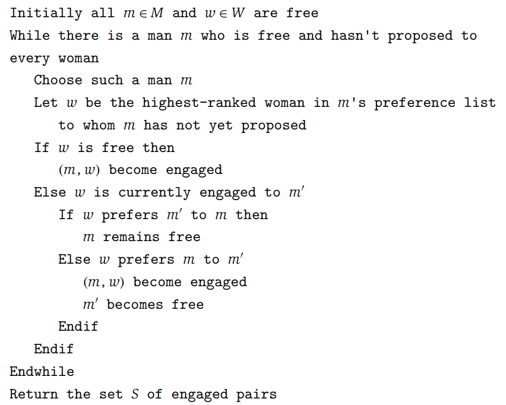

# Stable Matching
- Consider a situation that requires **matching** - i.e. a set of internship applicants with an ordered preference list of companies and the actual companies with an ordered preference list of applicant 
    - The goal of the problem here is to have a self-enforcing, or **stable** way of matching the two parties; for every employer E and every applicant A:
        - *E* prefers every one of its accepted applicants to *A*
        - *A* prefers their current situation over working for employer *E*
- For this problem, assume that there are *N* applicants and *N* companies, which only seek a single applicant
    - This problem can also be extended to heterosexual marriages between men and women
- A set *M = {m1, m2, ... mn}* of n men and a set *W = {w1, w2, ... wn}* of n women can create all ordered pairs *(m, w)* represented by the set *M X W*
    - A **matching set** *S* is a set of ordered pairs from *M X W* such that each member of *M* and each member of *W* appears in at most one pair in *S* (note that it can appear in zero pairs if a matching is not possible)
    - A **perfect matching set** *S'* is a set where each member of *M* and each member of *W* appear in exactly one pair in *S'*
- Each man *m* in *M* ranks all the women, with this ordered ranking (that allows no ties) present in a *preference list*
    - Each woman *w* in *W* does the same and ranks all the men
- There is an unstable matching if there are two pairs *(m, w)* and *(m', w')* in *S* such that *m* prefers *w'* **and** *w'* prefers *m* (it is necessary for both cases; if only one held true, then the other would not leave their partner because they are happy)
    - A matching is **stable** if it is is perfect and if there is no instability
## Algorithm
- The algorithm for this problem assumes that all men and women are initially unmarried and an unmarried man *m* chooses the woman *w* highest on his preference list and proposes to her - they do not get immediately married but rather there is an intermediate *engagement*
    - Another free man (not married) *m* chooses the highest-ranked woman *w* that *he hasn't proposed to yet* and proposes to her 
        - If *w* is also free, then they become engaged; otherwise, if *w* is already engaged to *m'*, then she determines which between *m* and *m'* is higher on her preference list and engages with them (the other is free)
    - The algorithm terminates when no one is free
- 
## Algorithm Analysis
- In this algorithm, a woman *w* receives better and better partners whereas a man *m* proposes to worse and worse women
- The algorithm terminates after at most *n2* iterations in the possible case where each man proposes to a woman he has never proposed to before (*n* men, *n* women, so  *n2* possible cases) 
- The algorithm does return a stable matching because:
    - If a man *m* is free at some point during the algorithm, then there is a woman to whom he has not yet proposed (as otherwise the algorithm would never end)
        - Contradiction: If there is a man *m* who is free but has proposed to every woman, then this implies that each of the *n* women have been engaged at some point - this means that there are *n* engaged men, which is not true
    - The set S returned at termination is a perfect matching
        - Contradiction: If the algorithm terminates with a free man, it must be the case that *m* has already proposed to every woman, but this contradicts the prior statement
    - The set *S* is a stable matching
        - Contradiction: Assume that there is an instability within *(m, w)* and *(m', w')* such that *m* prefers *w'* and *w'* prefers *m*
            - If *m* did not propose to *w'* at some point in the algorithm, then it is implied that *w* occurs higher than *w'* on *m*'s preference list, which is a contradiction
            - Otherwise, if *m* did propose to *w'* at some point in the algorithm, then it is implied that he was rejected by *w'* in favor of another man *m''*, who was then replaced by *m'*, but this implies either that *m''* = *m'* or *w'* prefers *m'* to *m''*, both of which are contradictions