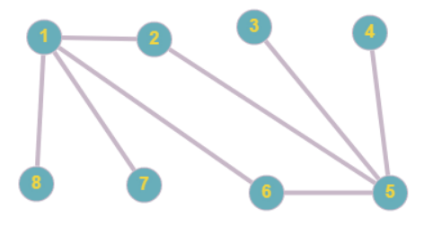
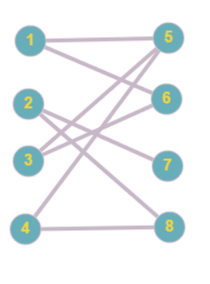

# Graphs
- Graphs are a collection of vertices and edges
    - G = {V, E}
    - These vertices and edges can be represented via sets
        - V = {x1, x2, x3, x4, x5} 
        - E = {(x1, x2), (x3, x1), ... (x4, x5)}
## Matching
- Given a graph G(V, E), a *matching* is a subgraph of G where every node or edge has degree 1
- The *degree* of a vertex is the number of edges connected to it  
- 
    - Here, it is impossible to have a *perfect matching* because of vertices 7 and 8 each having a degree of one, meaning that they will both have to connect to vertex 1, which would then have a degree of 2
- A matching is *perfect* if it has size |V|/2 (each vertex has exactly one other vertex)
    - 
        - A perfect matching consists of (1, 5), (2,7), (3, 6), and (4, 8)
- A weight of a perfect matching is the sum of the weights of all pairs of edges
    - A min-weight perfect matching is a perfect matching with a minimum weight among all possible perfect matchings
- Given a match M, X and Y (that do not appear in M) make a *rogue* couple if they prefer each other compared to the current match
    - A perfect match M is *stable* where there are *no* rogue couples 
# NP Completeness
- There are a set of problems that cannot be completed, known as *NP complete*
    - There are a set of NP complete problems where, if one problem is solved, then all others are solved

