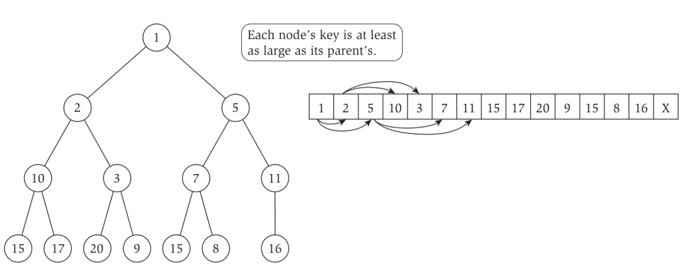
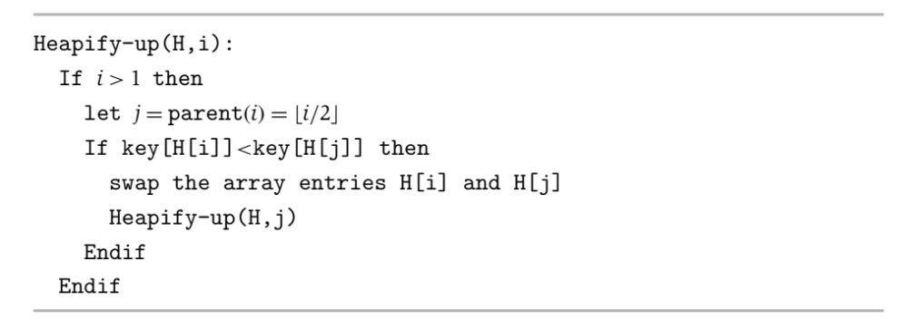
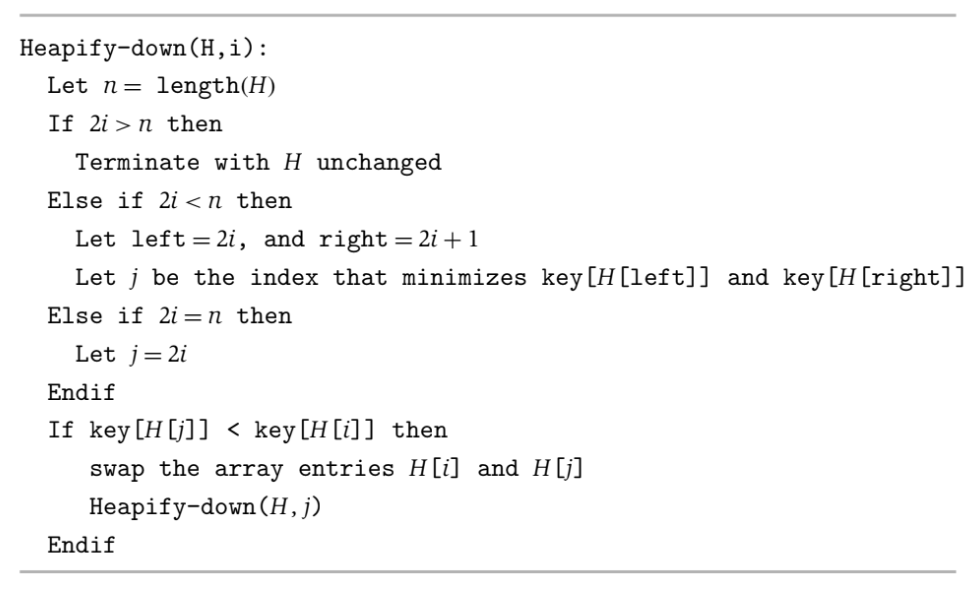
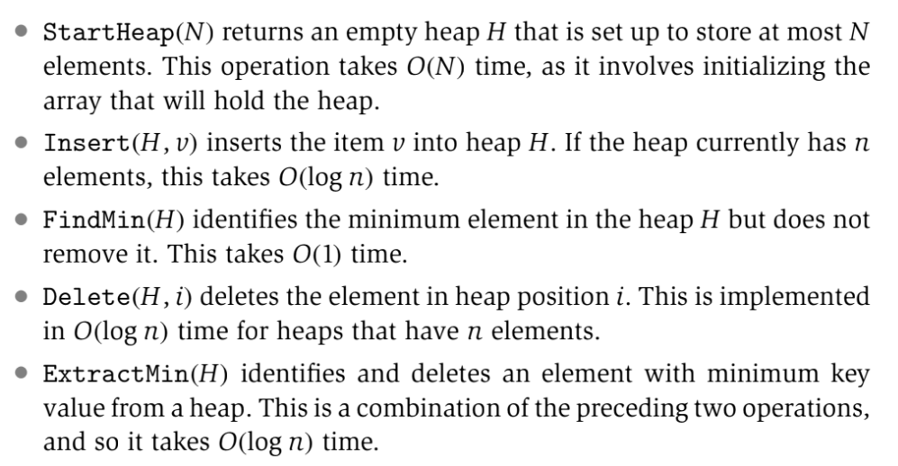

# Basics of Algorithm Analysis
## Computational Tractability
- In algorithm analysis, there are many ways to gauge performance
- A common approach to determining whether an algorithm is efficient gauging **whether it performs, at the worst-case, better than a *brute-force* search**
    - Since many computational problems are discrete by nature, a brute-force approach involves trying all possibilities within a problem's *search space* until one that works is found
        - i.e. For the Stable Matching problem, trying every possible perfect matching (this is very large since there are *n!* possible perfect matchings between *n* men and *n* women)
- Another approach towards determining whether an algorithm is efficient is **determining if the algorithm has a *polynomial running time***
    - Many problems with a known polynomial-time algorithm *tend* (but are not guaranteed) to have moderately growing polynomials (i.e. *n*, *nlogn*, *n2*, etc.)
    - Problem that do not have any known polynomial-time algorithms *tend* (but are not guaranteed) to be very difficult
        - If it has been proven that no polynomial-time algorithms for a problem exist, then it can be expressed that *there no efficient algorithm for the problem*
## Asymptotic Order of Growth
- Let *f(n)* be a bound on the running time of an algorithm with inputs of size *n*
- The notion of **asymptotic upper bounds** (worst case time) can be represented as **O(f(n))**
- The notion of **asymptotic lower bounds** (best case time) can be represented as **Ω(f(n))**
- If the running time of an algorithm is bounded by the same function *f(n)* (in other words, it has bounds O(f(n)) Ω(f(n))), then there is an **asymptotic tight bound** of Θ(f(n))
## Priority Queues
- Priority queues can be implemented using the **heap** data structure, which is a balanced binary tree (represented **as an array**) that maintains keys in *heap order* - meaning that, for every element *v* at node *i*, the element *w* at *i*'s parent satisfies *key(w)* < *key(v)*
    - Representing heaps via arrays keeps it balanced at all times
        - **leftChild(i) = 2i + 1** (zero index)
        - **rightChild(i) = 2i + 2** (zero index)
        - **parent(i) = floor((i-1)/2)** 
    - 
- Heap operations such as insertion and deletion can be performed in *O(log(n))* time
    - During an insertion, the element is added to the end of the array and then repeatedly swapped with its parent until the heap property is once again maintained
        - This process of repeatedly swapping is known as **heapify up**, and it takes O(log(n)) time to perform (since it at most follows the tree-path from a leaf to the root, which is log(N), where N is the number of nodes in the tree)
        - 
    - During a deletion, the element at the position being deleted is first swapped with the last element in the heap array and *then deleted* - this previously-last element is then repeatedly swapped either up or down until the heap property is once again maintained
        - 
- **Priority Queue Implementation**
    - 
    - If arbitrary heap elements need to be accessed, then an additional array should be maintained that stores the current position of each element in the heap
        - An element *v* can be deleted, then, using *Delete(H, Position[v])*
        - The key value of an element can also be changed using *ChangeKey(H, v, a)*, which changes the heap key value of element *v* to *key(v) = a*
            - This requires identifying the heap position of element *v* using the position array, changing its key value, and then applying heapify-down or heapify-up in order to maintain the heap property
