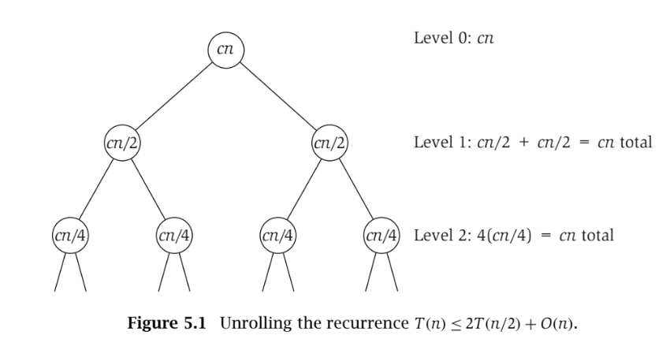
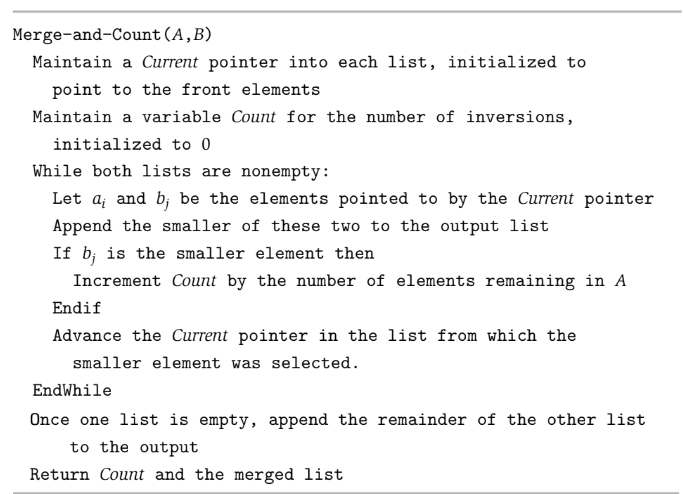
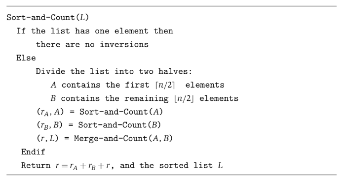
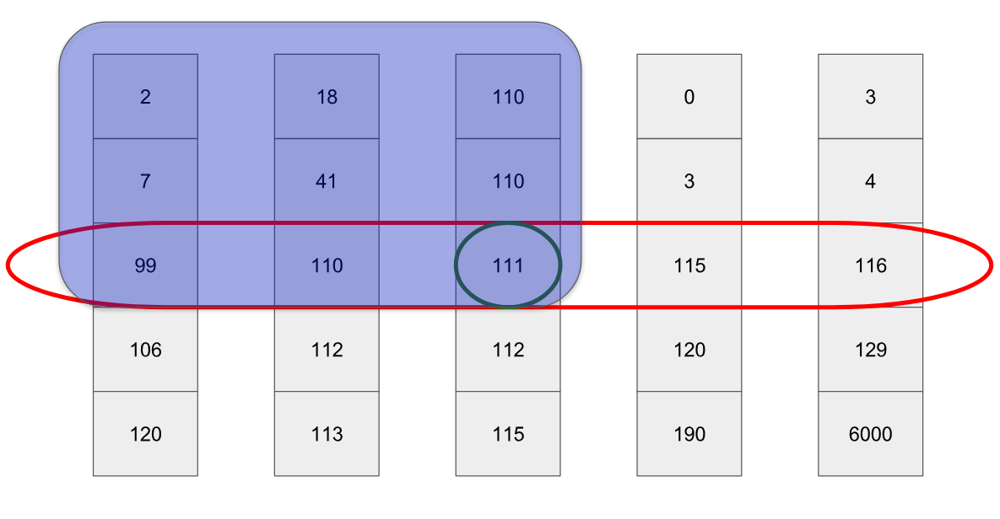
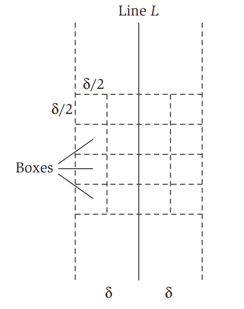
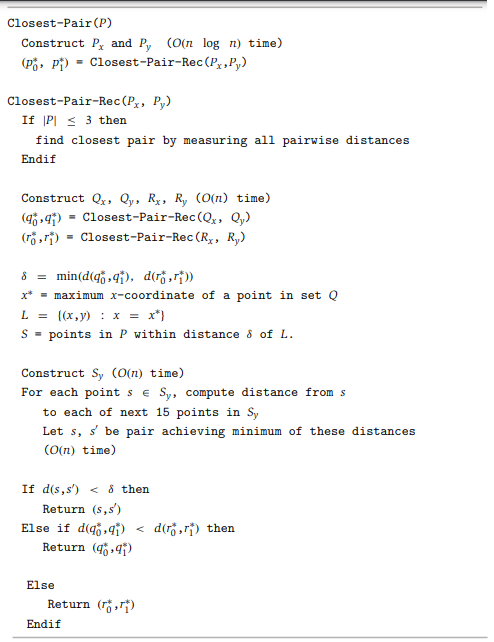

# Divide and Conquer
- **Divide-and-conquer** refers to algorithmic techniques where a problem is broken into several parts, and each problem is solved recursively and then combined with other solutions into an overall solution
- The runtime of divide-and-conquer can often be found by solving a recurrence relation associated with the algorithm
## Mergesort
- The mergesort algorithm sorts a list by dividing it into two equal halves, sorting each half recursively, and then combining the results of each recursive call
- The algorithm spends *O(n)* time to divide the input into two pieces of size *n/2*, then spends *T(n/2)* to solve each half, and finally spends *O(n)* time to combine the two solutions
    - *T(n) <= 2T(n/2) + O(n) = 2T(n/2) + cn*
        - *T(2) <= c* 
- One approach to solving recurrences is to *unroll* the recursion and determine some sort of pattern
    - 
    - At level *j* of the recursion, the number of subproblems has doubled *j* times for a total of *2j*, but each problem has also correspondingly shrunk by a factor of *2j* for a size of *n/2j*
        - Thus, each level *j* contributes a total of at most *(2j)(cn/2j) = cn* running time 
        - At each level there is *cn* work, and the number of levels of recursion is simply *log2n* (since the input is getting halved each time) and therefore the running time is *O(nlogn)*
- Another approach to solving recurrences is to *guess* a running time and verify it by plugging it into the recurrence relation
    - For the mergesort algorithm, guess that *T(n) <= cnlog2n* for *n >= 2*
        - This holds for the base case of *n = 2* since *c(2)log22 = 2c* and *T(2) <= c* (so *c <= 2c*, which holds)
        - Assuming *T(m) <= cmlog2m* holdsfor *m < n*, it just needs to be proven for *n*
            - *T(n) <= 2T(n/2) + cn*
            - *T(n) <= 2c(n/2)log2(n/2) + cn*
            - *T(n) <= cn(log2n - 1) + cn*
            - *T(n) <= cn(log2n)*
## Further Recurrence Relations
- Consider more general divide-and-conquer algorithms that create recursive calls on *q* subproblems of size *n/2* and combine the results in *O(n)* time
    - *T(n) <= qT(n/2) + cn*
        - *T(2) <= c*
- Case of *q > 2*:
    - The bound is *O(nlog2q)*
- Case of *q = 2*:
    - The bound is *O(nlogn)* (proven earlier)
- Case of *q = 1*:
    - The bound is *O(n)*
## Counting Inversions
- Consider the problem of counting the *number of inversions* in a sequence
    - i.e. For [2, 4, 1, 3, 5], there are three inversions: (2, 1), (4, 1), and (4, 3)
- This problem can be brute-forced by looking at every single pair of numbers in the sequence, taking *O(n2)* time
- A more efficient, *O(nlogn)* solution can be found using divide-and-conquer
    - The list can be divided into two pieces and the number of inversions *within each individual half* can be found and then added to the number of inversions *between each half*
    - 
    - 
        - In the merge step, if *B*'s current element *bj* is less than *A*'s current element *ai*, then it is clear that *bj* is also less than the rest of *A*'s elements (*ai* to *an*) since *A* is sorted
            - This means that there are as many inversions as there are remaining elements in *A*
## Quicksort and Quickselect
- Quicksort (and Quickselect) relies on the **partition** method which, given an array and a **pivot**, divides array such that all elements less than the pivot are before all elements greater than the pivot
    -     Partition(A, low, high, pivot_function):
            # Get index of pivot
            # The pivot_function is some arbitrary function that 
            # chooses a pivot index (i.e. first element, last element, randomly)
            pivotIndex = pivot_function(A)
            pivot = A[pivotIndex]
            # Put pivot at the very end
            swap(A[pivotIndex], A[high])
            i = low - 1
            for each j in low to high:
                if A[j] < pivot:
                    i++ 
                    swap(A[i], A[j])
            # Pivot is at the very end, so put it in correct position
            swap(A[i+1], A[high])
            # Return pivot index
            return i + 1
    - The partition method takes *O(n)* time
- Quicksort is another divide-and-conquer algorithm that is able to efficiently sort large data sets without using as much memory as Mergesort (which requires an extra array during its merging step)
    - The algorithm works by partitionining the array and then recursively calling itself on each half
    -     Quicksort(A, low, high, pivot_function):
            if low < high:
                pi = Partition(A, low, high, pivot_function)
                Quicksort(A, low, pi - 1, pivot_function)
                Quicksort(A, pi + 1, high, pivot_function)
    - The average case complexity of the algorithm is *O(nlogn)*
        - On average, the pivot is expected to divide the array in half, requiring only *logn* calls to Quicksort, each of which perform partition - resulting in *O(n * logn) = O(nlogn)* complexity
    - The worst case complexity of the algorithm is *O(n2)*
        - It could be the case that the pivot is chosen such that the array is partitioned into *n-1* and *1* elements, which results in a worst case of *n* calls to Quicksort, each of which call partition - resulting in *O(n * n) = O(n2)* complexity
- Quickselect is a divide-and-conquer algorithm that is able to find the k-th smallest element in an unordered list
    - The algorithm works by partitioning the array, checking if the k-th element is to the left of the pivot, to the right of the pivot, or at the pivot itself (in which case it has found the element), and then recursively calling itself on the appropriate half
    -     QuickSelect(A, low, high, k, pivot_function):
            loop:
                if low == high:
                    return low
                pi = Partition(A, low, high, pivot_function)
                if k == pi:
                    return A[pi]
                # Must be to the left of the pivot
                else if k < pi:
                    right = pi - 1
                # Must be to the right of the pivot
                else:
                    left = pi + 1
    - The average-case complexity is *O(n)*
    - The worst-case complexity is *O(n2)
    - Linear performance can *always be achieved* by using the **Median of Medians** algorithm for the pivot
        - It divides the input list into groups of five elements, computing the median for each, and then recursively computes the true median of the *n/5* medians - this is used as the pivot
        - To compute the median, it calls QuickSelect itself (mutual recursion)
        - In the worst case, using the Median of Medians splits the partitions the array between 30%/70% and 70%/30%
            - Half of the *n/5* groups (*(1/2)(n/5) = n/10*) have their median less than the pivot 
                - The first two elements in the group are less than their median and must therefore also be less than the pivot, so there are at least three elements less than the pivot (*(3)(n/10) = 3n/10*) within these groups
            - Half of the *n/5* groups ((*(1/2)(n/5) = n/10*)) have their medians greater than the pivot
                - The last two elements in the group are greater than their median and must therefore also be greater than the pivot, so there are at least three elements greater than the pivot (*(3)(n/10) = 3n/10*) within these groups
            - This means that the pivot is less than *3n/10* elements and greater than another *3n/10*, which puts a worst-case splitting of 30-70 (or 70-30)
            - $T(n)\leq T(n/5) + T(n \times 7/10) + c \times n$  
                - $T(n/5)$ denotes the cost for finding the true median of the *n/5* groups 
                - $T(7n/10)$ denotes the Quickselect recursion worst case
                - $c\times n$ denotes the partitioning work
                - It can be inductively shown that this recurrence is *O(n)*
            - 
## Finding the Closest Pair of Points
- Consider the problem of, given *n* in the plane, finding the pair that is closest together
- The algorithm takes the points *P* and recursively finds the closest pair among points in the left half and the closest pairs among points in the right half: it must be the case that the closest pair is either in the left half, in the right half, or between the two halves
    - Assume that, on every recursive call, there are two lists: the points in *P* sorted by x-coordinate *Px* and the points in *P* sorted by y-coordinate *Py*
    - The left half of points is denoted as *Q* (with lists *Qx* and *Qy* representing its coordinates sorted) and the right half of points is denoted as *R* (with lists *Rx* and *Ry* representing its coordinates sorted)
    - Let *δ* be the minimum distance found in the two halves - it is necessary to determine if there are a pair of points *(q, r)* such that *q* is in *Q* and *r* is in *R* and *d(q, r) < δ*
    - Let *L* be the line (along the x-axis) separating the two halves: If it is the case that there exists a *(q, r)* pair such that *d(q, r) < δ*, then each of *(q, r)* must lie within a distance *δ* of *L*
        - If they are separated in terms of x by more than *δ*, then there is no possible way for the distance between them to be smaller than *δ* (according to distance formula)
        - This means that points *P* within *δ* of *L*, denoted as *S*, only need to be considered
    - Geometrically, it can be observed that, if *s, s' in L* have the property that *d(s, s') < δ*, then *s* and *s'* are within 15 positions of each other in sorted *Sy*
        - 
        - Since *δ* is the minimum distance among the two halves, no two points can be within the same box
            - Two points being in the same box implies a distance of $δ \cdot \sqrt2/2$, which is less than *δ* - a contradiction to the assumption that each half has a minimum distance between points of *δ* (since each box cannot cross halves)
        - Assume there are two points *s, s'* that have a distance less than *δ* and are at least 16 positions apart in *Sy*
            - Since there can only be one point per box, there are at least three rows of boxes lying between *s* and *s'*
            - Any two points in separated by at least three rows must have a distance of at least *3δ/2*, which is a contradiction
- 
    - This takes *O(nlogn)* time