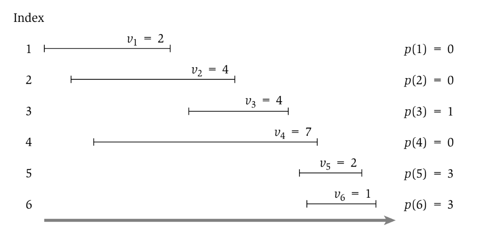
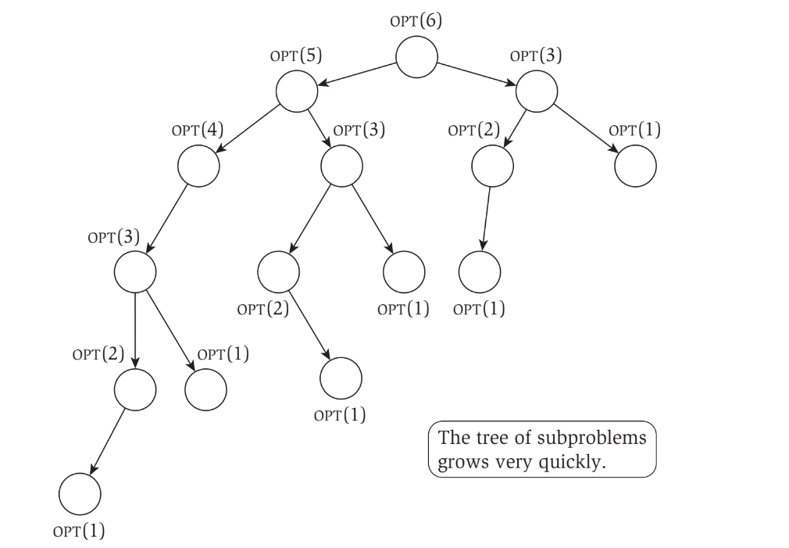
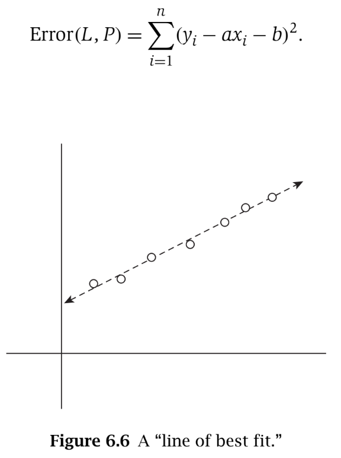
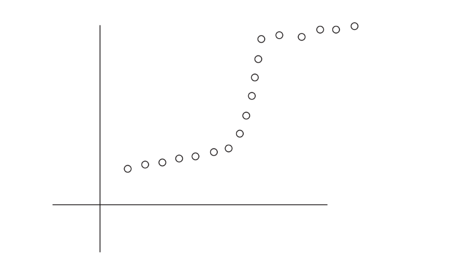
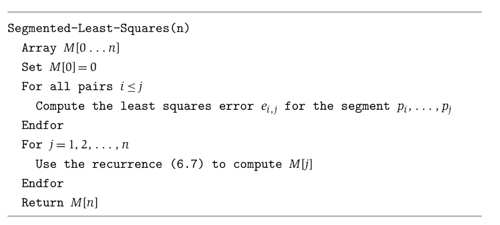
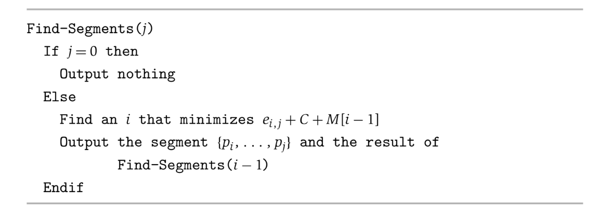
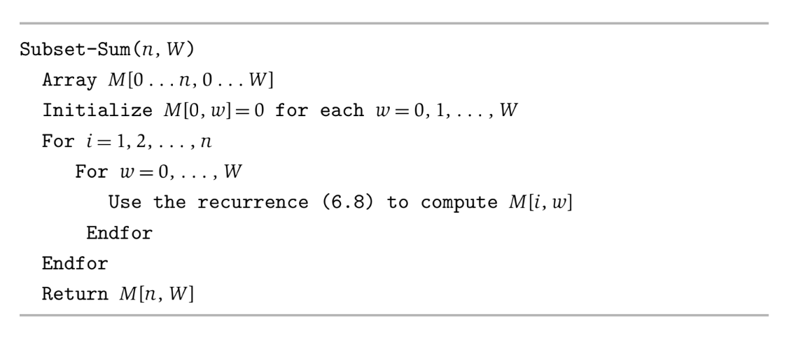
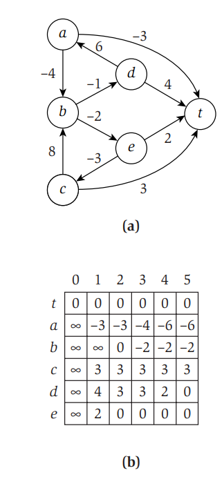
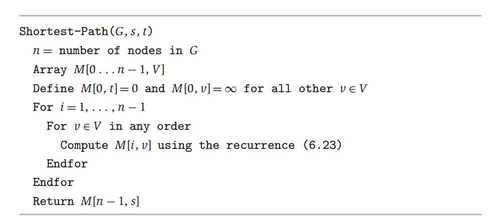
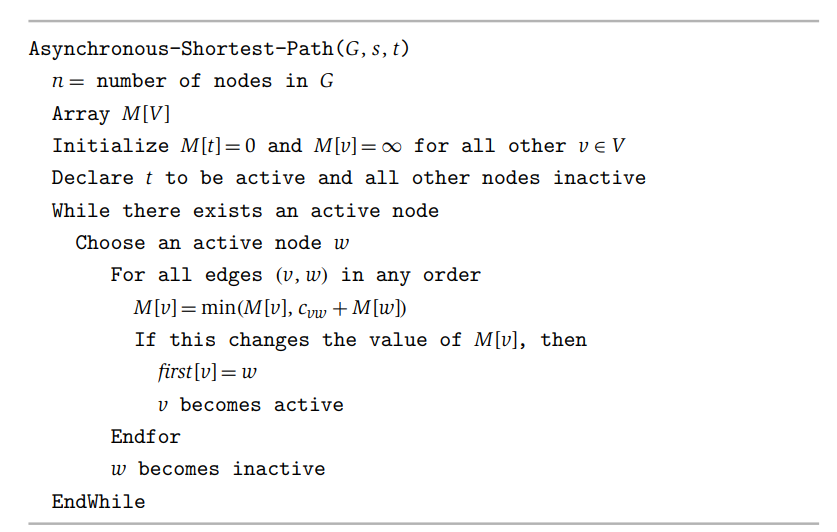

# Dynamic Programming
- **Dynamic programming** algorithmic approach that decomposes a problem into a series of subproblems and then builds up a larger solution from these subproblem-solutions
- Dynamic programming is relevant when a problem has the following properties:
    - There are only a polynomial number of subproblems
    - The solution to the original problem can easily be computed from the solutions to the subproblems
    - There is a natural ordering of subproblems from "smallest" to "largest" that allows one to determine the solution to a subproblem from the solutions to some number of smaller subproblems
## Weighted Interval Scheduling
- Consider the Interval Scheduling Problem, with the added condition that each interval has a *weight* and the goal is to find a set of nonoverlapping intervals with a *maximum total weight*
- Let the intervals be sorted in nondecreasing finishing time (*f1 <= f2 <= ... <= fn*) and let *p(j)* be the largest index *i < j* such that the intervals *i* and *j* do not overlap
    - 
- Consider the optimal solution *O*: the last interval *n* either belongs to *O* or it does not
    - If *n* is in *O*, then no interval between *p(n)* and *n* can belong in *O* since all such intervals overlap with *n*
        - If *n* is in *O*, then *O* must include an optimal solution to the problem of requests  *{1, ... , p(n)}*
    - If *n* is not in *O*, then *O* is equal to the optimal solution of requests *{1, ... , n - 1}*
    - Thus, *`OPT(j)` = max(wj + `OPT(p(j))`, `OPT(j-1)`)*
        - Request *j* belongs to an optimal solution for *{1, 2, ... , j}* if and only if *vj + `OPT(p(j))` >= `OPT(j-1)`*
-     Compute-Opt(j)
        If j = 0
            Return 0
        Else
            Return max(v[j] + Compute-Opt(p(j)), Compute-Opt(j-1))
        Endif
    - This implementation can potentially have an exponential runtime
        - 
    - However, it can be noticed that subproblems are *repeated* and therefore *recalculated* 
        - The runtime can be optimized by *storing the solutions to these subproblems* so that they do not need to be recalculated when needed again - this is known as **memoization**
        -     M-Compute-Opt(j)
                If j = 0 then
                    Return 0
                Else if M[j] is not empty
                    Return M[j]
                Else
                    Define M[j] = max(v[j] + M-Compute-Opt(p(j)), M-Compute-Opt(j-1))
                    Return M[j]
                Endif
- The runtime of the memoized solution to this problem is *O(n)* since there can only be at most *O(n)* calls to `M-Compute-Opt` (think of it as there being only at most *n* subproblems to solve, each of which takes constant time to actually solve)
- To actually get the set of intervals containing the optimal solution, the memo array can be used to "trace back" and rebuild the optimal schedule
    -     Find-Solution(j)
            If j = 0
                Output nothing
            Else
                If v[j] + M[p(j)] >= M[j-1] then
                    Output j together with the rest of Find-Solution(p(j))
                Else
                    Output the rest of Find-Solution(j-1)
                Endif
            Endif
## Memoization or Iteration over Subproblems
- **Top-down memoization** is one approach to dynamic programming where, as the name suggests, recursion is used to split the large problem into smaller subproblems that are solved
- Another approach to dynamic programming is **bottom-up tabulation**, where optimal solutions to subproblems are *built up iteratively* until the solution to the main problem is reached
    - For the previous problem:
        -     Iterative-Compute-Opt
                M[0] = 0
                For j = 1, 2, ... , n
                    M[j] = max(v[j] + M[p(j)], M[j-1])
                Endfor
## Segmented Least Squares
- The error of a single linear regression line is
    - 
- What if, however, a set of data points correspond to *multiple* lines of best fit?
    - The number of lines used should be balanced with the amount of error - though using too many lines should also be penalized as otherwise a new line could be used for each pair of consecutive points
    - 
        - There are three lines that can be fitted in this example
- Consider a set of *n* data points *P = {(x1, y1), (x2, y2), ... , (xn, yn)}* where the points sorted by increasing *x*
    - *P* can be partitioned into some number of segments, representing a contiguous set of *x-coordinates*
    - For each segment *S* in the partition, compute the least-squares regression line for those points
    - Define the *penalty* of a partition to be the sum of the number of segments that have been partitioned times some fixed, given multiplier *C* and the error value of the optimal line through each segment
- An approach to this problem makes use of the fact that the last point, *pn* belongs to a single segment in the optimal partition, and this segment begins at some earlier point *pi*
    - If this last segment is known, then the problem can be solved with the remaining points *p1, ... , pi-1*
    - Thus, *`OPT(n)` = ei,n + C + `OPT(i-1)`*
    - *`OPT(j)` = min(ei,j + C + `OPT(i-1)`)*
        - The minimum is found among all points *i* such that *1 <= i <= j* - the algorithm should find the least-squares error for all possible segments
- 
    - There are *O(n2)* pairs *(i, j)* and the process of computing the error requires summing all of them, so it would take *O(n3)* time; the for loop takes *O(n)* time, so the total runtime is *O(n3)*
    - 
## Subset Sums and Knapsacks
- Given *n* items *{1, ... , n}* with nonnegative weight *wi* and a bound *W*, find a subset of items *S* so that the sum of their weights is less than *W* but still as large as possible
- The last item, *n* will either be in the optimal solution or not
    - If it is in the optimal solution, then there is now a new subproblem with *n - 1* items and a weight bound of *W - wn*
    - If it is not in the optima solution, then there is now a new subproblem with *n - 1* items but still the same weight bound of *W*
- The optimal solution is therefore in terms of both the number of items and the weight bound
    - If *w < wi*, then *`OPT(i, w)` = `OPT(i - 1, w)`*. Otherwise, *`OPT(i, w)` = max(`OPT(i-1, w)`, w[i] + `OPT(i-1, w-w[i])`)* 
    - 
- The table used for this algorithm is of dimension *n x W* since there are subproblems corresponding to each potential subset size and each weight
    - The runtime is therefore *O(nW)*
- The Knapsack Problem is an extension to the Subset Sum Problem, where each item *i* has a nonnegative weight *wi* but also a value *vi* - the goal now is to find a subset of maximum value with the restriction that the weight does not exceed *W*
    - *`OPT(i, w)` = max(`OPT(i-1, w)`, vi + `OPT(i-1, w-w[i])`)*
## Shortest Paths in a Graph
- Dijkstra's Algorithm does not work for graphs with negative weight edges 
    - The algorithm does not account for the case where a path may initially be more expensive but then much more cheaper than other paths once a large negative weight is encountered
- An algorithm that *can* find the shortest path for a graph with negative weight edges is the **Bellman-Ford Algorithm**, which utilizes dynamic programming approach 
    - If the graph *G* has no negative cycles, then the shortest path from node *s* to *t* can have at most *n - 1* edges
    - Using this observation, the sub-problem of finding the shortest path using at most *i* edges, where *i <= n - 1*, can be used to construct a larger solution for finding the shortest path using at most *n - 1* edges
- If the optimal path *P* using at most *i* edges from node *v* to *t* can be represented as *`OPT(i, v)`*, then:
    - If path *P* uses at most *i - 1* edges, then `OPT(i, v) = OPT(i - 1, v)`
    - If path *P* uses *i* edges, and its **first** edge is *(v, w)*, then `OPT(i, v) = c(vw) + OPT(i - 1, w)`
    - *`OPT(i, v)` = min(`OPT(i - 1, v)`, minw in V(`OPT(i - 1, w)` + c(vw)))*
- Example:
    - 
    - At each *i*, each node *v*'s *outgoing neighbors* are considered and, if there is a neighbor *w* such that the shortest path to *w* plus the cost of the edge *vw* is less than *v*'s current shortest path, *v*'s shortest path is updated
- 
    - The algorithm has a running time of *O(mn)*
    - An improvement can be made to this implementation where an array *M* of size *n* is instead used, where *M[v]* stores the length of the shortest path from *v* to *t* found so far
    - To actually *recover* the shortest path after the algorithm terminates, each node should maintain a variable storing the first node after itself on the path to *t*
        - Whenever *M[v]* is updated, *first[v]* should be correspondingly updated to point to the node *w* that updated its shortest path
- The Bellman-Ford Algorithm can be used in distributed systems, such as communication networks, to find the shortest path using only *local knowledge*
    - Whenever a node (say a router) has its shortest path updated, it sends out an message to all of its neighbors, which then determine if their shortest path is updated using the information (and if it is, send an update to all of *their* neighbors)
        - 
    - This approach, known as the **Distance Vector Protocol**, works if the edge weights *do not change*, but is prone to failure otherwise - especially in the case where edges may be deleted
        - Network routing schemes tend to instead use **Path Vector Protocols**, where each node stores not just the distance and the first node to the shortest path, but also a representation of the entire path