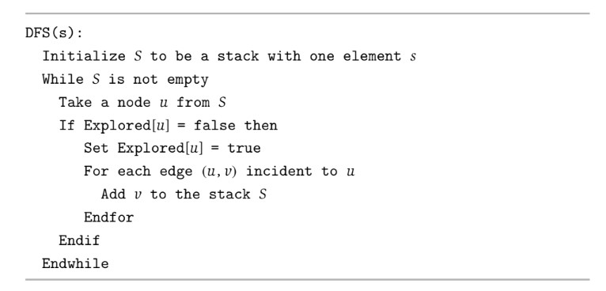

# Graphs
## Graph Traversals
- There are two common traversal algorithms that can be used to determine node-to-node connectivity (that is, if there is a path *s* to *t* in *G*) - breadth-first search and depth-first search
    - Using an adjacency list representation of graphs, both of these algorithms take *O(n + m)* time, where *n* is the number of nodes and *m* is the number of edges in the graph
- Any traversal algorithm (breadth-first search or depth-first search) starting at a node *s* will return a set *R* that is the *connected component* of the graph containing *S*
### Breadth-First Search
- In **breadth-first search**, exploration is done outward from *s* in all possible directions adding nodes *layer by layer*
    - Let layer *L1* consist of all nodes that are neighbors of *s*, and layer *Lj + 1* consist of all nodes that do not belong to an earlier layer and that have an edge in layer *Lj*
    - It is the case that a layer *Lj* is the set of all nodes at a distance *j* exactly from *s* - so breadth-first search computes not only the nodes that *s* can reach but also the shortest (unweighted) paths to them
- 
- Breadth-first search produces a tree *T* rooted at *s* on the set of nodes reachable from *s* - when a node *v* is first discovered, the node *u* it was discovered from is used to add an edge *(u, v)* to the tree *T*
    - 
    - Each level (or depth) of *T* contains nodes from the corresponding layer (i.e. depth 1 contains the nodes found in *L1)
### Depth-First Search
- In **depth-first search**, exploration is done by traversing deeply as possible and only backtracking when necessary
- 
- Depth-first search also produces a tree *T* rooted at *s* in a similar fashion to the breadth-first search tree
    - There is a difference, though, in how this tree is structured since the order of the node traversal is different
## Bipartiteness
- A bipartite graph is one where the set of nodes *V* can be partitioned into sets *X* and *Y* such that every edge has one end in *X* and another end in *Y*
    - A graph is bipartite if its nodes can be colored such that every edge has one end colored differently (red) from the other end (blue)
- It can be trivially shown that *if a graph G is bipartite, then it cannot contain an odd cycle*
- An algorithm to determine bipartiteness is to start at some node *s* and assign it one of the two colors - say, *red*
    - Its neighbors must therefore be assigned *blue*, and their neighbors must be assigned *red* - this is done until the whole graph is colored
    - If every edge has ends of opposite colors, then the graph is bipartite - otherwise, it is not
    - The algorithm can do this coloring on top of breadth-first search, by associating a color with each layer (i.e. red for even indexed layers and blue for odd indexed layers) and, after the search completes, scanning all edges to determine if there are any edges in which both ends have the same color
## Connectivity in Directed Graphs
- For directed graphs, breadth-first search and depth-first search can still be used, but now it will return the set of nodes reachable from *s* - it could be the case that there is a path to *t* from *s* but not a path to *s* from *t*
    - To find the set of nodes with paths *to s*, a new directed graph *Grev* can be defined such that every edge direction is reversed
        - Running breadth-first search or depth-first search starting from *s* yields the set nodes that has a path *to s* in *G* (the original graph)
- A directed graph is **strongly connected** if, for every two nodes *u* and *v*, there is a path from *u* to *v* and a path from *v* to *u* - that is, they are *mutually reachable*
    - Reachability is transitive, so if *u* and *v* are mutually reachable, and *v* and *w* are mutually reachable, then *u* and *w* are mutually reachable
- To determine the *strong component* of a directed graph, run a traversal algorithm (BFS or DFS) on the graph *G* and the reversed version of the graph *Grev* - the set of nodes reached by *both* traversals is the strong component
    - For any two nodes *s* and *t* in a directed graph, their strong components are either identical or disjoint