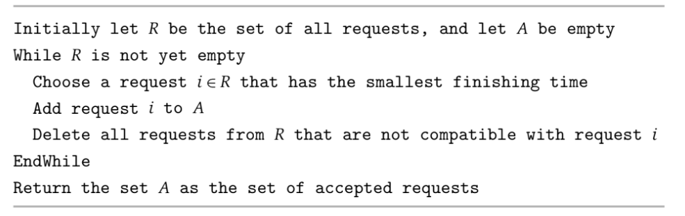

# Greedy Algorithms
- An algorithm is **greedy** if it builds up a solution in small steps, choosing a decision at each step that *best* satisfies some constraint
    - Problems that can be solved using greedy algorithms often possess some local decision rule that can be used to construct optimal solutions 
## Interval Scheduling
- One approach to proving that a greedy algorithm produces an optimal solution to a problem is to justify that **the greedy algorithm stays ahead** - in other words, justifying that it does better than any other algorithm at each step
- Consider the Interval Scheduling Problem where, given a set of requests *{1, 2, 3, ..., n}* the *ith* request corresponds to an interval of starting time *s(i)* and finishing time *f(i)*; the goal is to find as large a compatible subset as possible - that is, find the most amount of requests that do not overlap
- There are many possible greedy rules that could be implemented for this problem, such as those favoring the earliest request, those favoring the shortest requests, or those favoring requests that are most compatible with other requests
- The greedy rule that actually *works* is one that favors accepting *requests that finish first* - requests for which *f(i)* is as small as possible
    - 
        - Sorting the orders by finishing time takes *O(log(n))*, and the actual algorithm itself completes in one pass at *O(n)*, so the runtime is just *O(log(n))*
- To prove that this approach works, let *O* be the optimal set of intervals - the goal is to show that the output of the algorithm, *A*, contains the same number of intervals as *O*
    - If *O* contains requests denoted by *j1*, ..., *jm* and *A* contains requests denoted by *i1*, ..., *ik*, then the greedy rule guarantees that *f(ir) <= f(jr)* for all indices *r*
        - Inductively, consider the base case of *r = 1* - it is obvious here that *f(i1) <= f(j1)* since the definition of the rule is to select the interval with the earliest finishing time
        - Assuming *f(ir - 1) <= f(jr - 1)* holds (induction hypothesis), then there is no way the greedy algorithm can fall behind the optimal
            - Since *O* contains compatible intervals, *f(jr - 1) <= s(jr)*, and since *f(ir - 1) <= f(jr - 1)*, we know that *f(ir - 1) <= s(jr)*
            - This means that the greedy algorithm always has the option, at worst, to choose interval *jr* since it is in the set of intervals available, which thus implies that *f(ir) <= f(jr)* (completing the induction hypothesis) 
    - The greedy algorithm returns an optimal set *A* - if it were not optimal, then *O* would have more requests, but since *f(ir) <= f(jr)*, there would be a request *jk+1* in *O* that starts after *ik* ends, which is a contradiction since the greedy algorithm would have added it to the set *A*
### Scheduling All Intervals
- A related problem to Interval Scheduling is scheduling *all* requests using as few resources as possible
    - Let *d*, the *depth* of a set of intervals, to be the maximum number of intervals that pass over any single point - this is the optimal number of resources
    - 
- This algorithm is able to work because no two overlapping intervals will be assigned the same label - if there are not enough labels, then the depth would have been higher (and thus there would be more labels to assign)
## Minimizing Lateness
- Another approach to proving that a greedy algorithm produces an optimal solution is to **transform any possible solution to the problem into the solution found by the greedy algorithm**
- Consider the problem of Scheduling to Minimize Lateness, where requests can now start at any time - each request *i* has a deadline *di* and requires a contiguous time interval of length *ti*
    - An interval starting at *s(i)* and finishes at *f(i) = s(i) + ti*; *i* is late if it misses its deadline, and the lateness is defined as *li = f(i) - di*
    - The goal of the problem is to schedule all intervals, without overlapping requests, as to minimize the *maximum lateness*, *L = maxili
- The greedy algorithm that produces an optimal solution to this problem is follows the *Earliest Deadline First* rule, sorting jobs in increasing order of deadline *di*
    - 
- A schedule *A'* has an *inversion* if job *i* with deadline *di* is scheduled before another job *j* with earlier deadline *dj* < *di* - if there are jobs with identical deadlines, there can be different schedules with no inversions
    - The scheduled returned by the algorithm, *A*, has no inversions (by definition)
    - It can be shown that schedules with *no inversions* and *no idle time* have the same maximum lateness
        - If two different schedules have neither inversions nor idle times, then they can only differ in the order in which jobs with *identical deadlines*, *d* are scheduled
        - Among all jobs with the identical deadline *d*, the *last one* has the greatest lateness, and this lateness does not depend on the order of the jobs - so all schedules with no inversions and no idle time have the same maximum lateness
    - The crux of the proof is to show that there is an optimal schedule that has no inversions and no idle time
        - It is trivial to show that there is an optimal schedule *O* with no idle time
        - If *O* does have an inversion, then there is a consecutive pair of jobs *i* and *j* such that *i* is scheduled before *j* and *dj* < *di* - if *i* and *j* were swapped, then the new schedule has a maximum lateness no larger than that of the original, *O*
            - This swap only affects the finishing times of *i* and *j* - after the swap, *i* finishes at time *f(j)*
                - 
            - Job *j* will get finished earlier in the new schedule, so its lateness will not increase
            - Job *i*, which finishes at *f(j)* will have a lateness of *f(j) - di*, but since it is known that *di* > *dj*, it can be shown that *f(j)* - *di* < *f(j)* - *dj*, so the swap could *not* increase the maximum lateness of the schedule
- Thus, the greedy algorithm produces a schedule with no inversions and no idle time, and since all schedules with no inversions and no idle time produce the maximum lateness, it follows that the greedy algorithm is optimal
## Optimal Caching
- Consider the problem of Cache Eviction - this problem can also be solved greedily using the rule of *Farthest-in-Future*
- Before proving this algorithm's optimality, it is important to differentiate *reduced* cache schedules and *non-reduced* cache schedules 
    - The former does the minimal amount of work by bringing an item *d* into the cache at step *i* if there is a request to *d* in step *i* and *d* is not already in the cache
    - The latter may bring in items in steps when they are not requested
- It can be shown that there exists a reduced schedule *S'* that brings in as many items as the schedule *S*, which may not be reduced
    - *S'* is similar to *S* except in steps where *S* brings in an item *d* that has not been requested - *S'* does not bring in the item
    - *S'* only brings in *d* when it is requested (in step *j*) - the cache miss incurred by *S'* in step *j* can be charged to the earlier cache operation performed by *S* in step *i*, which proves the point that *S'* brings in at most as many items as *S*
- The algorithm's optimality can be proven using the fact: *Let S be a reduced schedule that makes the same eviction decisions as SFF through the first j items in the sequence. Then there is a reduced schedule S' that makes the same eviction decisions as SFF through the first j + 1 items and incurs no more misses than S does*
    - At request *j + 1*, both *S* and *SFF* have the same cache contents; if the requested item is already in the cache or both *S* and *SFF* evict the same item, then everything is fine - the main issue occurs when S evicts *e* and SFF evicts *f*
        - In this case, *S'* should try to get its cache contents back to the same state as *S* as quickly as possible
        - From request *j + 2* onward, *S'* behaves exactly like *S* until there is either
            - A request to item *g* not equal to *e*, *f* is not in the cache of *S*, and *S* evicts *e* to make room for it 
                - In this case, both *S'* and *S* had only differed on *e* and *f*, so *S'* does not have *g* either - this means that *S'* can evict *f*, ensuring that both *S* and *S'* behave the same for the rest of the sequence
            - A request to *f*, and *S* evicts *e'*
                - If *e' = e*, then *S* and *S'* will once again be the same
                - If *e' is not equal to e*, then *S'* should evict *e'* as well and bring in *e* - although *S* and *S'* are once again the same, *S'* is no longer a reduced schedule, so it must be transformed into its reduction, which does not increase the number of items brought in by *S'* using the previous fact
        - In the aforementioned first case, both *S* and *S'* have the same number of misses; in the second case, *S'* incurs at most as many misses as *S*
        - Since the algorithm is farthest in the future, either of the aforementioned cases will arise *before* a reference to *e* - so before a request to *e* could occur, a request to *f* must first occur
- Given the optimal schedule *S\**, consider the schedule *S1* that agrees with *SFF* through the first step - this is the base case
    - The previous fact can be applied inductively, producing schedules *Sj* that agree with *SFF* through the first *j* steps, where each schedule incurs no more misses than the previous one - this can be done until at *m* steps are produced, in which case *Sm* = *SFF*
## Shortest Paths in a Graph
- The shortest path in a graph with *positive weighted edges* can be solved greedily via Dijkstra's algorithm, which maintains a set *S* of vertices *u* for which the shortest-path distance, *d(u)* has already been determined - for all "unexplored" vertices *v* on the graph, the shortest path is constructed along a path through the explored path *S* followed by a single edge *(u, v)*  
    - **Implementation**
        - 
        - The algorithm can run in *O(mlog(n))* time, where *m* is the number of edges and *n* is the number of nodes, via the usage of priority queues
            - The nodes *V* are put in a priority queue with *d'(v)* as the key for *v*
            - Selecting a node *v* to be added to *S* involves making use of the `ExtractMin` operation
                - `ExtractMin` takes *O(1)* time
            - When a node is extracted, the keys of any node *w* still in the priority queue that has an edge with *v* are updated to be the minimum of their current distance or the distance of *v* plus the weight of the edge
                - `ChangeKey` is called if *e' = (v, w)* exists and min(*d'(w)*, *d(v) + le'*) = *d(v) + le'*
                - `ChangeKey` takes *O(logn)* time since the priority queue has *n* elements, and the operation can occur at most once per edge, so the runtime is *O(mlogn)*
        - In essence, all nodes will be put into the priority queue, initialized with a *d'(v) = infinity*, except for the source node which will have *d'(s) = 0*
            - The source node will then be extracted and added to *S* and each of its neighboring edges will have their keys updated using `ChangeKey`
            - The algorithm will continue, taking the next unexplored node with the smallest distance (in other words, the node closest to the source) and repeat the process of updating its neighboring nodes if the new distance is smaller
            - This will repeat until all nodes have been explored
    - **Practical Implementation**
        - 
- Dijkstra's correctness can be proved by showing that it *stays ahead* of all other solutions
    - Consider the set *S* at any point in the algorithm's execution; for each *u* in *S*, the path *Pu* is the shortest *s-u* path
        - In the base case of *|S| = 1*, this is trivial since *S* consists of the source vertex *s*, which has a *d(s) = 0*
        - Assuming the claim holds true when *|S| = k*, it just needs to be proved for the case of *|S| = k + 1* by adding the node *v*, which forms the edge *(u, v)* on the *s-v* path *Pv*
        - Consider some other *s-v* path *P*, which must leave the set *S* at some point since it is not *Pv* - assume that the first node on *P* that is not in *S* is *y*, and *x* is the node in *S* just before *y*
            - 
            - *P* cannot be shorter than *Pv* because it is already *at least* as long as *Pv* by the time it exits *S* since otherwise the algorithm would have would have added *y* to *S* via the edge *(x, y)* instead of *v* via *(u, v)* - the algorithm greedily chooses the shortest distance path, and *y* was rejected in favor of *v*
            - Thus, adding *(y, v)* to *P* would only result in *P* being guaranteed to be greater than or equal to *Pv* since edges (as specified earlier) cannot be negative - this shows that *Pv* is always the shortest path for the *|S| = k + 1* case, so the induction hypothesis remains true
## The Minimum Spanning Tree Problem
- The Minimum Spanning Tree problem is another instance where greedy algorithms work - in fact, multiple greedy approaches work
    - **Kruskal's Algorithm**: Start without any edges and build a spanning tree by inserting edges from E in order of increasing cost - an edge *e* is inserted as long as it does not create a cycle (as otherewise it would not be a spanning *tree*) among already-inserted edges
    - **Prim's Algorithm**: Start from a root node *s* and greedily grow a tree from *s* outward by adding a node that can be attached as cheaply as possible to the partial tree 
        - For a set *S* on which a spanning tree has been constructed so far (initially, *S = {s}*), add the node *v* that minimizes the attachment cost mine=(u,v):u in SCe
            - For similar reasons to Dijkstra's, Prim's Algorithm can be implemented in *O(mlogn)* time by making use of a priority queue to store the minimum attachment costs for nodes *v*
                - When a node is extracted using `ExtractMin`, the attachment cost of its neighboring nodes is updated using the `ChangeKey` operation
    - **Reverse-Delete Algorithm**: Start with the full graph *(V, E)* and then begin to delete edges *e* in order of decreasing cost as long as deleting *e* does not actually disconnect the graph
- Kruskal's and Prim's algorithms make use of the *Cut Property*: Let *S* be any subset of nodes that is neither empty nor equal to all of *V*, and let edge *e = (v, w)* be the minimum-cost edge with one end in *S* and the other in *V - S*. Then, every minimum spanning tree contains edge *e*. 
    - 
        - Consider a spanning tree *T* that does not contain *e = (v, w)*; it can be shown that *T* does not have the minimum possible cost
        - Since *T* is a spanning tree, there must be a path *P* in *T* from *v* to *w* - let *w'* be the first node in *P* that is in *V - S* and let *v'* be the node just before *w* (so it is in *S*)
        - The edge *e* can be exchagned for *e'*, and the resulting graph *T'* is still a spanning tree since *T* is connected and any path that used *e = (v', w')* can be rerouted to go from *v'* to *v* and then from *w* to *w'*
            - *T'* is also acyclic since a cycle would only occur if *both* *e* and *e'* were edges, but since there is an exchange there is only one of the two edges
        - Since *e = (v, w)* is the minimum-cost edge with one end in *S* and the other in *V - S* (by definition), *ce* < *ce'* and the cost of *T'* is less than *T*
    - It can be shown that Kruskal's Algorithm only adds edges that are justified by the cut property
        - The algorithm adds edges *e = (v, w)* such that *v* is in *S* but *w* is not - and since it adds edges in order of increasing cost, *e* is the minimum-cost edge with one end in *S* and the other in *V - S*
        - The algorithm, by definition, avoids creating cycles and ensures that the resulting tree is connected (if the input graph itself is connected)
    - Likewise, for Prim's Algorithm, it can be shown that each edge added that minimizes the attachment cost is the *cheapest edge* with one end in *S* and the other in *V - S*
        - It can also be trivially shown that Prim's Algorithm results in a spanning tree
- The Reverse-Delete algorithm make use of the *Cycle Property*: Let *C* be any cycle in *G*, and let edge *e = (v, w)* be the most expensive edge belong to *C*. Then *e* does not belong to any minimum spanning tree of *G*
    - 
        - Deleting *e* from *T* partitions the nodes into two components - *S*, which contains *v* (and the minimum tree path), and *V - S*, which contains *w*
        - The other edges of *C* form a path *P* with one end at *v* and the other at *w*, so some other edge *e'* can be used to cross from *S* to *V - S*, and since *e* is the most expensive edge on the cycle *C*, it is the case that *e'* is cheaper than *e* and therefore forms a cheaper spanning tree
    - The Reverse-Delete algorithm always removes edges that lies on a cycle *C*, and since it deletes in decreasing order of cost, it is always deleting the msot expensive edge, which agrees with the cycle property
        - The algorithm will never disconnect the graph and, by definition, ensures that no cycles remain