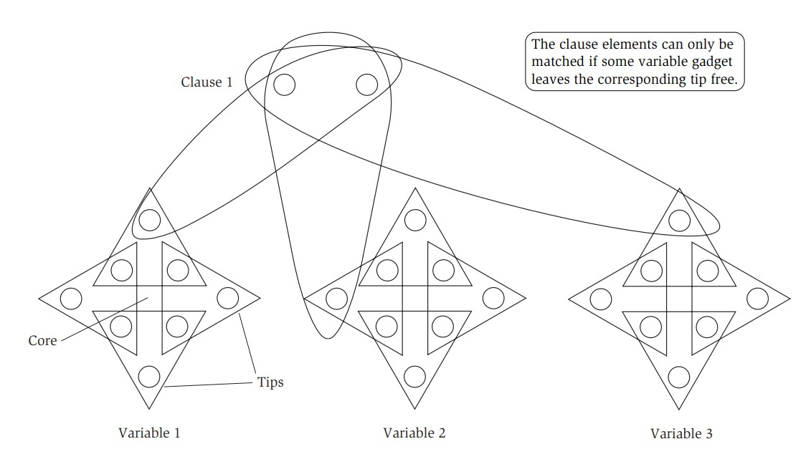

# NP and Computational Intractability
## Polynomial-Time Reductions
- When considering extremely hard computational problems, the notion of a **reduction** is useful to compare the relative difficulty of problems
- Consider problems *X* and *Y*, and suppose that there exists a **black box** that could solve instances of *X* in a single step
    - If arbitrary instances of *Y* could be solved in a polynomial number of standard computational steps and a polynomial number of calls to the black box for *X*, then *Y is polynomial-time reducible to X*
        - *Y ≤P X*
        - This implies that if there does exist a polynomial-time algorithm that solves *X*, then, by extension, there is also a polynomial-time algorithm time algorithm to solve *Y*
- If *Y ≤P X*, then if *Y* cannot be solved in polynomial time, then *X* also cannot be solved in polynomial time
### Independent Set and Vertex Cover
- In a graph *G = (V, E)*, a set of nodes *S ⊆ V* is independent if no two nodes in *S* are joined by an edge; the **Independent Set Problem** involves finding a large enough independent set in *G*
    - **Optimization version**: Find the maximum size of an independent set for *G*
        - Given a solution to the optimization version, the decision version can be solved 
    - **Decision version**: Determine whether or not (yes or no) *G* has an independent set of size at least *k*
        - Given a solution to the decision version, the optimization version can be solved (binary search for each *k* until the largest *k* is found)
    - 
        - Largest independent set: {1, 4, 5, 6}
- In a graph *G = (V, E)*, a set of nodes *S ⊆ V* is a vertex cover if every edge *e in E* has at least one end in *S*; the **Vertex Cover Problem** also has a optimization and decision version akin to the Independent Set Problem, except now the goal is to get as small as a vertex cover as possible
    - 
        - Smallest Vertex Cover: {2, 3, 7}
- It can be shown that the Independent Set Problem reduces into the Vertex Cover Problem and vice-versa: A set *S* is an independent set if and only if its complement *V - S* is a vertex cover
    - If *S* is an independent set, then an arbitrary edge *e = (u, v)* cannot both be in *S*, so one of them must be in *V - S*; this argument can be applied to every edge, implying that *V - S* is a vertex cover
        - A black box that solves the Decision Independent Set Problem can solve the Vertex Cover Problem by deciding whether *G* has an independent set of size at least *n - k*
    - If *V - S* is a vertex cover, then two nodes *u* and *v* in *S* cannot be joined by an edge *e* because neither of them would be in *V - S*, contradicting that it is a vertex cover - so *S* must be an independent set
        - A black box that solves the Decision Vertex Cover Problem can solve the Independent Set Problem by deciding whether *G* has a vertex cover of size at most *n - k*
### Set Cover and Set Packing
- A more general version of the Vertex Cover Problem is the Set Cover Problem: *Given a set U of n elements, a collection S1, ..., Sm of subsets U, and a number k, does there exist a collection of at most k of these sets whose union is equal to U?*
    - 
    - The Vertex Cover Problem reduces to the Set Cover Problem: A black box that can solve the Set Cover Problem can be used to solve the Vertex Cover Problem
        - The set *U* is equal to *E* in the context of the graph, and each time a vertex *i* is chosen, all edges incident to it are added to a set *Si*
        - If sets *Si1 ..., Sil*, where *l <= k*, cover *U*, then every edge in *G* is incident to one of the vertices *i1, ..., il*, so the set of such vertices is a vertex cover in *G* of size *l <= k*
- A more general version of of the Independent Set Problem is the Set Packing Problem: *Given a set U of n elements, a collection S1, ..., Sm of subsets U, and a number k, does there exist a collection of least k of these sets with the property that no two of them intersect?*
    - The reduction can be perofmred in the same way as the Vertex Cover Problem to Set Cover Problem
## Reduction via "Gadgets": The Satisfiability Problem
- Given a set *X* of *n Boolean variables x1, ..., xn*, a *term* over *X* is one of these variables *xi* or its negation *x̄i*, and a *clause* of length *l* is a disjunction (an **OR**) of *l* distinct terms
    - *t1 ∨ t2 ∨ ... ∨ tl*
- A truth assignment is a mapping of false (0) or true (1) to each *xi*; this means that *x̄i* has the *opposite* truth value of *xi*
    - An assignment *satisfies* a clause *C* if it causes *C* to evaluate to true, and an assignment satisfies a collection of clauses *C1, ... , Ck* if it causes all clauses to evaluate to true (an **AND**)
        - *C1 ∧ C2 ∧ ... ∧ Ck*
- The **Satisfiability Problem (SAT)**, another computationally hard problem, asks, *given a set of clauses C1, ..., Ck over a set of variables X = {x1, ..., xn}, does there exist a satisfying truth assignment?*
    - The **3-SAT Problem** is concerned with clauses of length three
- It can be shown that the 3-SAT Problem can be reduced to the Independent Set Problem
    - This can be done by constructing a graph *G* consisting of *3k* nodes grouped into *k* triangles connected by edges such that a vertex *vij* is the *jth* terms from clause *Ci*
        - Additional edges are added for vertices whose labels correspond to terms that conflict (so the nodes corresponding to *xi* would form an edge with the nodes corresponding to *x̄i*)
        - 
    - If this resulting graph *G* possessed an independent set of size at least *k*, then the 3-SAT instance is satisfiable
        - If size of *S* is exactly *k*, it must consist of one node from each triangle (multiple nodes in the same triangle would imply that the set is not independent)
        - If one node in *S* were labeled *xi* and another were labeled *x̄i*, then this would be a contradiction because there is an edge between the two nodes so *S* would not be independent
            - Only one of the two can appear as a label in *S*; if only *xi* appears, it should be set to true and otherwise only if *x̄i* appears it should be set to false
            - Labels that don't appear in *S* can be arbitrarily set to true
        - In this way, it is ensured that all labels of nodes in *S* evaluate to 1, thus implying satisfiability
    - If the 3-SAT instance is satisfiable, then the resulting graph *G* has an independent set of size at least *k*
        - *S* must have one node from each triangle, and if there were an edge between two nodes *u, v* in *S*, then this would imply that their labels would have to conflict (since *u* and *v* cannot be from the same triangle), but this would contradict satisfiability since they must both evaluate to true
- Reductions are transitive, so:
    - *3-SAT ≤P Independent Set ≤P Vertex Cover ≤P Set Cover*
    - *3-SAT ≤P Set Cover*
## Efficient Certification and the Definition of NP
- For problems such as Independent Set and 3-SAT, it is hard to find polynomial-time algorithms to *solve* them; however, there are polynomial-time algorithms to *check* a proposed solution
    - For Independent Set, simply check that that no vertices in the proposed solution set have edges with each other
    - For 3-SAT, simply evaluate the clauses with respect to a proposed assignment of values to the terms
### Problems and Algorithms
- Consider the input, which can be encoded as a binary string *s* with length *|s|*, to a **decision problem**, represented by a set of strings *X* on which the answer is "yes"
    - An algorithm *A* for the decision problem *solves* *X* if, for all strings *s*, *A(s) = yes* if and only if *s* is in *X*
        - *A* has a *polynomial running time* if there is a polynomial function *p()* such that for every *s*, *A* is bounded by *O(p(|s|))*
        - 𝒫 is the set of all problems *X* for which there exists an algorithm *A* with polynomial running time that solves *X*
### Efficient Certification
- An algorithm *B* is an *efficient certifier* for a problem *X* if it is a polynomial-time algorithm that takes the problem input *s* and a certificate string *t* and there is a polynomial function *p* so that for every string *s*, *s* is in *X* if and only if there exists a string *t* such that *|t| <= p(s)* and *B(s, t)=yes*
    - *B* effectively tries to evaluate the proof *t* that *s* belongs to *X*, as long as *t* is not too long 
### NP: A Class of Problems
- 𝒩𝒫 is the set of all problems for which an efficient certifier exists, and it can be observed that **𝒫 ⊆ 𝒩𝒫**, since, if a polynomial-time algorithm to solve a problem exists, the certifier can simply output the result of that algorithm
- Although many computationally hard problems, such as 3-SAT, Independent Set, and Set Cover, belong to 𝒩𝒫, there is no current proof that a problem in 𝒩𝒫 does not belong to 𝒫
    - The question of 𝒫 = 𝒩𝒫 is unknown, but is generally believed to be not true
## NP-Complete Problems
- A problem *X* is **NP-Complete** if (i) *X ∈ 𝒩𝒫* and (ii) for all *Y ∈ 𝒩𝒫*, Y ≤p X
    - If *X* is an NP-Complete problem, then it is solvable in polynomial time if and only if 𝒫 = 𝒩𝒫
        - If *X* can be solved in polynomial time, then any other 𝒩𝒫 problem *Y* can be reduced to *X* and then solved in polynomial time as well
- To show that a problem is NP-Complete, it must be shown that the problem can encode *any* problem in 𝒩𝒫
- One example of a problem in 𝒩𝒫 is the **Circuit Satisfiability Problem**
    - Consider a circuit built out of gates implementing the standard boolean operations: ∧ (AND), ∨ (OR), and ¬ (NOT)
    - The circuit *K* is a directed acyclic graph where the *sources* are labeled with a constant boolean value (0 or 1) or a distinct variable (*inputs*), and every other nodes are labeled with boolean operators (directed either one node for NOT or two nodes for AND or OR)
    - The problem seeks, given a circuit *K*, whether there is an assignment to the inputs such that the circuit outputs true (1)
    - 
        - The circuit is satisfiable if the inputs (three on the bottom right) are 1, 0, and 1
- It has been shown that Circuit Satisfiability is NP-Complete, which can be intuitively justified by the fact that any algorithm that takes a fixed number of bits and produces a yes or no output can be represented as a circuit
    - The number of steps the algorithm takes is the size of the circuit (so a polynomial time algorithm corresponds to a polynomial size circuit)
    - To show that *X ≤p Circuit Satisfiability*, consider a black box that can solve Circuit Satisfiability
        - Since *X* is assumed to be in 𝒩𝒫, it is known to have an efficient certifier *B*, which is a *polynomial-time algorithm*
        - *B* can be converted into a polynomial-size circuit with the first *n* sources being hard-coded with the values of the input to *X*, *s*, and the remaining *p(n)* sources being inputs labeled with the bits representing *t*, the certifier
        - With this setup, *s ∈ X* if and only if there is a way to set the input bits to satisfy the circuit
        - Example Circuit: Given a graph *G*, does it contain a two-node independent set?
            - 
            - This circuit represents a graph of three nodes, *u, v, and w*, where *v* has an edge with both *u* and *w*
- If *Y* is an NP-Complete problem, and *X* is a problem in 𝒩𝒫 with the property that *Y* ≤p *X*, then *X* is NP-Complete
- It can be shown that 3-SAT is NP-Complete by showing that Circuit Satisfiability can be reduced to 3-SAT 
    - Construction of Circuit:
        - If a node *v* in the circuit is ¬ and its entering edge is *u*, then it needs to be the case that *xv = x̄u*, which can be guaranteed by adding the clauses *(xv ∨ xu)* and *(x̄v ∨ x̄u)*
        - If a node *v* in the circuit is ∨ and its two entering edges are *u* and *w*, then it needs to be the case that *xv = xu ∨ xv*, which can be guaranteed by adding the clauses  *(xv ∨ x̄u)*, *(xv ∨ x̄w)*, and *(x̄v ∨ xu ∨ xw)*
        - If a node *v* in the circuit is ∧ and its two entering edges are *u* and *w*, then it needs to be the case that *xv = xu ∧ xv*, which can be guaranteed by adding the clauses  *(x̄v ∨ xu)*, *(x̄v ∨ xw)*, and *(xv ∨ x̄u ∨ x̄w)*
        - For sources that have a constant value, a single-variable clause of *xv* or *x̄v* can be added to force the designated value, and for the output node *o*, a single-variable clause of *xo* can be added (requiring that *o* be 1)
    - If the given circuit *K* is satisfiable, then the satisfying assignments to the circuit inputs can be used to evaluate *all* nodes in the circuit, which can act as a solution to the constructed SAT instance
        - If the SAT instance constructed is satisfiable, then the values corresponding to the input variables of the circuit *K* can be used to satisfy *K*
    - The resulting *SAT* instance is not necessarily *3-SAT*, as some clauses possess only 1 or 2 terms
        - Clauses can be "extended" by adding four new terms *z1*, *z2*, *z3*, and *z4* such that *z1 = z2 = 0*
            - Add *(z̄i ∨ z3 ∨ z4)*, *(z̄i ∨ z̄3 ∨ z4)*, *(z̄i ∨ z3 ∨ z̄4)*, and *(z̄i ∨ z̄3 ∨ z̄4)* for *i = 1* and *i = 2*, which ensures that *z1 = z2 = 0* as otherwise all the clauses would not be satisfied
            - Clauses with only one term can have *z1* and *z2* added whereas clauses with two terms can have just *z1* added
    - Since *Circuit Satisfiability* can be reduced *3-SAT*, and *3-SAT* can be reduced into *Independent Set*, which can be reduced into *Vertex Cover*, which itself can be reduced into *Set Cover*, all these problems are *NP-Complete*
## Sequencing Problems
- The **Traveling Salesman Problem** and **Hamiltonian Cycle Problem** are both examples of problems that involve searching over all *permutations* over a collection of objects
    - The Traveling Salesman Problem asks, given a set of distances on *n* cities, and a bound *D*, whether there is a tour (which visits all cities and then returns home) of length at most *D*
    - The Hamiltonian Cycle asks, given a directed graph *D*, whether there is a cycle that visits each vertex exactly once
- To prove that the Hamiltonian Cycle Problem is NP-Complete, it can be shown that 3-SAT can be reduced to Hamiltonian Cycle
    - Consider an arbitrary instance of 3-SAT with variables *x1, ..., xn* and clauses *C1, ..., Ck*
    - A graph can be constructed such that it contains *2n* different Hamiltonian Cycles, corresponding to the *2n* possible assignments to the variables
        - 
            - There are *n* paths *P1, ..., Pn*, each corresponding to a truth variable 
                - If a Hamiltonian Cycle traverses a path *Pi* left to right, the corresponding variable *xi* should be set to 1 and otherwise it should be set to 0
    - Clauses can be represented in this graph in terms of the aforementioned paths - i.e. *x1 ∨ x̄2 ∨ x3* requires that *P1* traverse left to right or *P2* traverse right to left, or *P3* traverse left to right
        - 
            - An extra node is added for each clause
    - If there is a satisfying 3-SAT instance, then there is a Hamiltonian Cycle in the corresponding graph
        - Since each clause *Cj* is satisfied by the assignment, there will be at least one path *Pi* that is going in the correct direction relative to *cj*, allowing every vertex to be visited without any repetition
    - If there is a Hamiltonian Cycle in the corresponding graph, then there is a satisfying 3-SAT instance
        - If the cycle enters a clause node *cj*, then it must return to the same path that it departed from in the cycle, as otherwise it would not be able to finish traveling to all vertices on that path (this is assuming that the clause nodes are not spliced at the start or end of each path)
        - The truth assignments are associated with the direction in which each path is traveled, as mentioned earlier, and the presence of a Hamiltonian Cycle implies the existence of assignments which satisfy each clause since the clause nodes are all reached in the cycle
- The Hamiltonian Cycle Problem can be reduced to the Traveling Salesman Problem, showing that the latter is also NP-Complete
    - Given a graph *G*, each vertex can be considered a city
        - Two cities can be defined to have a distance of 1 if there is an edge between their corresponding cities on *G* - otherwise, they have a distance of 2
    - If *G* has a Hamiltonian Cycle, then there is a tour of length *n*
        - The tour can follow all vertices on the cycle, which results in a sum of *n*
    - If there is a tour of length *n*, then *G* has a Hamiltonian Cycle
        - The only way to get a length of *n* is to sum *n* terms of length 1, implying that all consecutive cities on the tour are connected by an edge on *G* - this implies a Hamiltonian Cycle
- The Hamiltonian Path Problem is similar to the Hamiltonian Cycle Problem, and it is also NP-Complete 
    - Given an instance of the Hamiltonian Cycle Problem on *G*, a new graph *G'* can be constructed by choosing an arbitrary node *v* and replacing it with two new nodes *v'* and *v''* such that all edges out of *v* are now out of *v'* and all edges into *v* are now into *v''*
        - If *G* has a Hamiltonian Cycle starting and ending at *v*, then *G'* has a corresponding Hamiltonian Path starting at *v'* and ending at *v''*
        - If *G'* has a Hamiltonian Path, then this path must begin at *v'* since it has no incoming edges and end at *v''* since it has no outgoing edge; this implies *G* has a Hamiltonian Cycle since *v'* and *v''* can be replaced with *v* to form an ordering that is a Hamiltonian Cycle in *G*
## Partitioning Problems
- The **Three-Dimensional Matching Problem** is as follows: *Given disjoint sets X, Y, and Z, each of size n, and given a set T ⊆ X × Y × Z ordered triples, does there exist a set of n triples so that each element of X ∪ Y ∪ Z is contained in exactly one of these triples?*
- It can be shown that 3-Dimensional Matching is NP-Complete by reducing 3-SAT to 3-Dimensional Matching
    - Consider an arbitrary instance of 3-SAT with *n* variables and *k* clauses
    - Each variable *xi* can be associated with a gadget, making use of elements *Ai = {ai1, ai2, ..., ai,2k}* (core) and *Bi = {bi1, bi2, ..., bi,2k}* (tip)
        - For each *j* from *1, 2, ..., 2k*, a triple is defined as *tij = (aij, ai,j+1, bij)*
        - A triple is *even* if *j* is even and otherwise it is odd
        - In a perfect matching, the only way for all elements in *Ai* to be covered is to either use all even triples in gadget *i* or all odd triples in gadget *i*, as using both an odd and an even would ultimately result in the same element from *A* being used twice (due to the *j* and *j + 1* indexing)
            - Using even triples leaves the odd tips of the gadget free whereas using odd triples leaves the even tips of the gadget free - this is analagous to the assignment of a truth value to a variable in a SAT instance - let true correspond to even tips being *free* and false correspond to odd tips being *free*
        - Clauses can be thought of as constraining which tips on gadgets should be free - i.e. *x1 ∨ x̄2 ∨ x3* requires that the even tips be free for gadget 1, or the odd tips be free for gadget 2, or the even tips be free for gadget 3
            - A *clause gadget* consists of two core elements *Pj = {pj, p'j}* and three triples containing *Pj* and a tip of the corresponding variable; if a term is *xi* then the triple would be *(pj, p'j, bi,2j)* and otherwise if a term is *x̄i* then the triple would be *(pj, p'j, bi,2j-1)*
                - Clause gadgets will never "compete" with each other for the same triple since each gadget *2k*, where *k* is the number of clauses, triples - so there are as many clauses for each variable and its negation
        - It may be the case that not all tips are covered, as there are *n·2k = 2nk* tips, and the triples cover *nk* of them while the clause gadgets covered *k* of them, leaving *(n - 1)k* tips uncovered
            - Thus, *(n - 1)k* cleanup gadgets can be added to the instance, such that each gadget consists of two core elements *Qi = {qi, q'i}* and there is a triple *(qi, q'i, b)* for *every* tip *b* in each variable's gadget
        - This construction can be partitioned into sets *X*, *Y*, and *Z* of equal size 
            - *X* is the set of *aij* with *j* even, the set of all *pj*, and the set of all *qi*
            - *Y* is the set of *aij* with *j* odd, the set of all *p'j*, and the set of all *q'i*
            - *Z* is the set of all tips *bij*
    - If the 3-SAT instance is satisfiable, then the choice of odd or even can be made for each variable gadget based on the corresponding SAT variable 
        - The clause gadgets should be able to be covered, and the cleanup gadgets can cover the remaining tips - this means that all elements are covered, implying a perfect matching
    - If there is a perfect three-dimensional matching, then this implies a satisfiable 3-SAT instance since each variable assignment in the SAT instance can be made based off of the corresponding variable gadget's covering (odd or even)
        - Since each clause gadget has been covered, this implies that each clause in the 3-SAT instance has been satisfied, thus implying a satisfying assignment
    - 
        - Notice how attempting to use both an even and odd triple results in double coverage, and notice how using only even or only odd triples results in full coverage for each gadget
## Graph Coloring
- **Graph Coloring** problems involve an undirected graph *G* and seek to assign a color to each node of *G* such that if *(u, v)* is an edge, both *u* and *v* have different colors
    - A *k-coloring* involves assigning colors from *{1, 2, ... k}* to each vertex
- The Graph Coloring Problem asks, given a graph *G* and a bound *k*, whether *G* has a k-coloring
- For *k = 2*, this problem is relatively simple - a graph *G* is 2-colorable if and only if it is bipartite, and this can be determined by running a breadth-first search in *O(m + n)* time
- For *k = 3* and beyond, however, the coloring problem is NP-Complete; it can be shown that 3-SAT can be reduced to 3-Coloring (and 3-Coloring can be reduced to k-Coloring)
    - Given an instance of 3-SAT, create a graph with nodes *vi* and *v̄i* corresponding to each variable *xi* and its negation
    - Additionally, create three special nodes corresponding to *True*, *False*, and *Base* and connect them together in a triangle
    - Each node *v* and its negation *v̄* should be connected to *Base*
        - 
        - From this constructed graph, both *v* and *v̄* must be assigned different colors from each other and different from *Base*, and one will get a color corresponding to *True* and the other will get a color corresponding to *False*, representing a truth assignment
    - For each clause, a six-node subgraph can be constructed in such a manner that a certain node can be colored only if the clause is satisfied
        - This subgraph can be attached to the aforementioned graph
        - Example: *x1 ∨ x̄2 ∨ x3*
            - 
                - If *v1*, *v̄2*, and *v3* all have the *False* coloring (whichever color *F* has), then it would mean that the topmost node would not be able to get a color
                    - The lowest two shaded nodes would be assigned the *Base* color, forcing the next three highest nodes to get (from left to right) the *False*, *Base*, and *True* colors - this leaves no possible coloring for the topmost node
    - If the constructed graph *G* has a 3-coloring, then this implies that the 3-SAT instance is satisfiable
        - Each node *vi* is assigned either the *True* color or *False* color, which corresponds to the assignment for *xi*
        - Due to how *G* was constructed, each clause corresponding to the attached subgraph must have at least one term that satisfies the entire clause as otherwise no coloring for that subgraph (and therefore the entirety of *G*) would be able to exist
    - If the 3-SAT instance is satisfiable, then the constructed graph *G* has a 3-coloring
        - *Base*, *True*, and *False* are all given arbitrary colors
        - *vi* is assigned the *True* color if *xi* is assigned true and the *False* color otherwise; *v̄i* is assigned the remaining color
        - A valid coloring will exist for the additional subgraphs only if their associated clauses are satisfiable, which is the case - so the entire graph will have a 3-coloring
