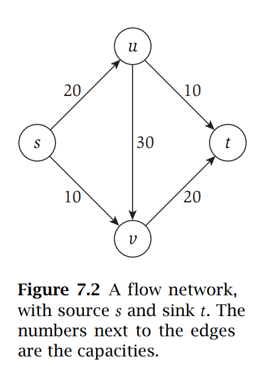
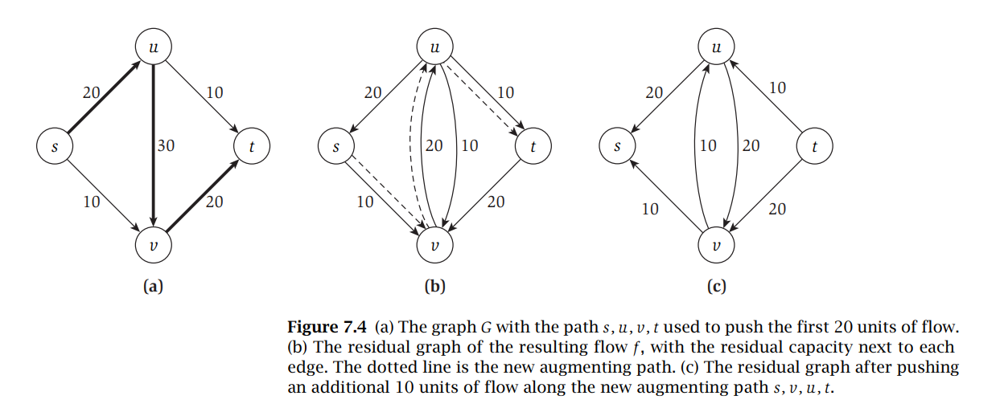
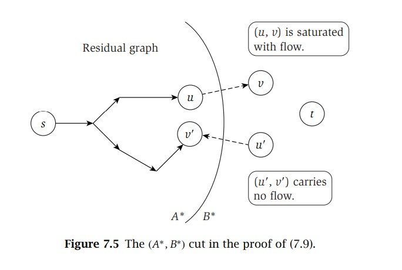

# Network Flow
- **Flow networks** are directed graphs that are commonly used to describe phenomena such as transportation networks, where nodes pass traffic (known as **flow**) to other nodes
    - Positive weights on edges are known as **capacities**, representing the maximum amount of flow that can pass between the two nodes
        - A flow *f(e)* carried by edge *e*, must satisfy the **capacity** and **conservation** conditions
            - Capacity: *0 <= f(e) <= ce*
            - Conservation: *Σe into v f(e) = Σfe out of v f(e)* 
    - Each flow network has a single **source node s**, which has no incoming edges, and a single **sink node t**, which has no outgoing edges
        - All flow enters the network through the source node and exits the network through the sink node
        - The value of a flow *f* is the amount of flow exiting the source or, alternatively, the amount of flow entering the sink
            - *v(f) = f out(s) = f in(t)*
    - 
## Maximum Flow
- The Maximum-Flow Problem seeks, given a flow network, a flow of maximum value
    - When thinking about this problem, an approach can be to divide the nodes of the graph into two sets *A* and *B* such that *s is in A* and *t is in B*
        - Any flow must cross from *A* to *B* in order to get from *s* to *t*, so the edge capacity from **set** *A* to **set** *B* is used up
        - This implies that a *cut* of the graph, or a partition into sets *A* and *B*, places a bound on the maximum possible flow, and it can be proved that the maximum flow is equal to the minimum capacity of any cut
- Consider pushing a flow through an arbritary path from *s* to *t*, such that the flow is as high as possible without breaking any of the edges' capacities (that is, push flow equal to the smallest capacity, the **bottleneck capacity**, of the path)
    - It may be the case that, after performing this operation, the maximum flow can be achieved by "undoing" flow on a certain edge and diverting it elsewhere
- It is often useful to consider the **residual graph** *Gf* with respect to the flow pushed *f*
    - *Gf* has the same nodes as *G*, but now there may be two edges for each original edge
    - If, for *e = (u, v)*, it is the case that *f(e) < ce*, then there is residual capacity of *ce - f(e)*
        - The **forward edge** *(u, v)* is included *Gf* with a **residual capacity** of *ce - f(e)*
    - If, for *e = (u, v)*, it is the case that *f(e) > 0*, then there is *f(e)* units of flow that can be diverted
        - The **backward edge** *(v, u)* is included in *Gf* with a **residual capacity** of *f(e)*
- The process of **augmenting** a path in the residual graph *P* involves identifying the **bottleneck capacity**, or minimum residual capacity, of any edge on *P*, and then altering the flow by this capacity - this creates a new flow *f'*
    -     augment(f, P)
            Let b = bottleneck(P, f)
            For each edge (u, v) in P
              If e = (u, v) is a forward edge then
                increase f(e) in G by b
              Else ((u, v) is a backward edge, and let e = (v, u))
                decrease f(e) in G by b
        - The capacity conditions are still maintained because of the choice of using the *bottleneck capacity*
            - Forward Edge: *0 <= f(e) <= f'(e) = f(e) + bottleneck(P, f) <= f(e) + (ce - f(e)) = ce*
            - Backward Edge: *ce >= f(e) >= f'(e) = f(e) - bottleneck(P, f) >= f(e) - f(e) = 0*
        - The conservation conditions are also still maintained
        - 
- **Ford-Fulkerson Algorithm** for Maximum Flow:
    -     Max-Flow
            Initially f(e) = 0 for all e in G
            While there is an s-t path in the residual graph Gf
              Let P be a simple s-t path in Gf
              f' = augment(f, P)
              Update f to be f'
              Update the residual graph Gf to be Gf'
            Return f
## Maximum Flows and Minimum Cuts in a Network
- A **cut** in a flow network is a division of nodes into two sets, *A* and *B*, such that *s ∈ A* and *t ∈ B*
    - The *capacity* of a cut *(A, B)*, denoted as *c(A, B)* is the sum of all capacities out of *A*: *Σe out of Ace*
    - *f out(A) = f in(B)*
    - *f in(A) = f out(B)*
- It can be shown that for any *s-t* flow *f*, and any *s-t* cut *(A, B)*, that *v(f) = f out(A) - f in(A)* - the flow of a network can be measured by the amount that exits *A* minus the amount that enters back into *A*
    - This can be proven using the fact that *v(f) = f out(s)* and *f in(s) = 0* and for any node in *A* other than *s*, *fout(v) - fin(v) = 0*, so:
        - $v(f) = \sum\limits_{v\in A}(f^{out}(v) - f^{in}(v))$
        - $\sum\limits_{v\in A}(f^{out}(v) - f^{in}(v)) = \sum\limits_{e\ out\  of \  A}f(e) - \sum\limits_{e \ into \ A}f(e) = f^{out}(A) - f^{in}(A)$
- If *f* is any *s-t flow* and *(A, B)* is any cut, then *v(f) ≤ c(A, B)*; the value of every flow is upper bounded by the capacity of every cut
    - $v(f) = f^{out}(A) - f^{in}(A) \leq f^{out}(A) = \sum\limits_{e \ out \ of \ A}f(e) \leq \sum\limits_{e \ out \ of \ A}c_e = c(A, B)$
    - Since the value of every flow is bounded by the capacity of every cut, if some minimum cut *c\** is found, then this minimum cut will correspond to a maximum flow
- The Ford-Fulkerson Algorithm terminates when the flow *f* has no *s-t* path in the residual graph *Gf* - this can be used to show that there is an *s-t* cut *(A\*, B\*)* such that *v(f) = c(A\*, B\*)* and that this cut has the minimum capacity of any *s-t* cut in *G* (and therefore *f* has the maximum value of any in flow in *G*)
    - Let *A\** denote all nodes in *G* in which there is an *s-v* path in *Gf* and *B\** denote *V - A\**
    - Consider *e = (u, v)* in *G*, where *u ∈ A\** and *v ∈ B\**; it *must* be the case that *f(e) = ce* as otherwise *e* would be a forward edge in the residual graph, implying a *s-v* path which would contradict the assumption that *v ∈ B\**
    - Consider *e' = (u', v')* in *G*, where *u' ∈ B\** and *v' ∈ A\**; it *must* be the case that *f(e') = 0* as otherwise there would be a backward edge in the residual graph, implying a *s-u'* path which would contradict the assumption that *u' ∈ B\**
    - $v(f) = f^{out}(A^{*}) - f^{in}(A^{*}) = \sum\limits_{e \ out \ of \ A^{*}}c_e - 0 = c(A^{*}, B^{*})$
    - 
- If all capacities in a flow network are integers, then there is a maximum flow *f* for which every flow value *f(e)* is an integer
    - If capacities were non-integer values, it is possible for the Ford-Fulkerson Algorithm to loop infinitely, as there could be cases where the value of the flow keeps increasing but in smaller and smaller increments