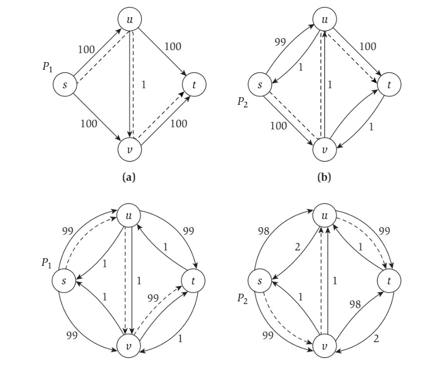
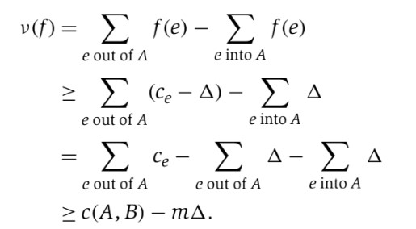
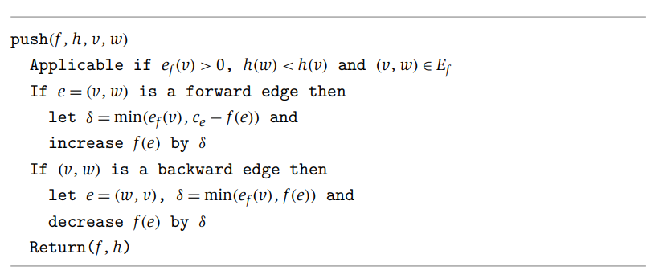
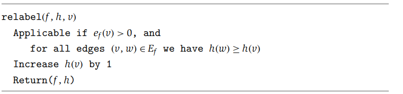
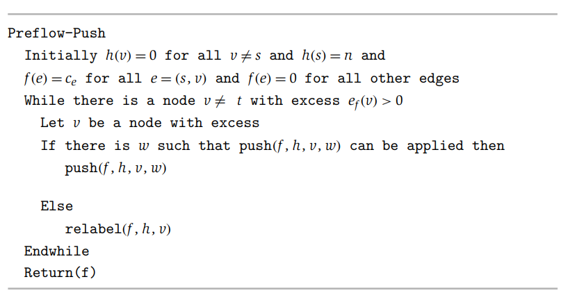

# Network Flow
- **Flow networks** are directed graphs that are commonly used to describe phenomena such as transportation networks, where nodes pass traffic (known as **flow**) to other nodes
    - Positive weights on edges are known as **capacities**, representing the maximum amount of flow that can pass between the two nodes
        - A flow *f(e)* carried by edge *e*, must satisfy the **capacity** and **conservation** conditions
            - Capacity: *0 <= f(e) <= ce*
            - Conservation: *Σe into v f(e) = Σfe out of v f(e)* 
    - Each flow network has a single **source node s**, which has no incoming edges, and a single **sink node t**, which has no outgoing edges
        - All flow enters the network through the source node and exits the network through the sink node
        - The value of a flow *f* is the amount of flow exiting the source or, alternatively, the amount of flow entering the sink
            - *v(f) = f out(s) = f in(t)*
    - 
## Maximum Flow
- The Maximum-Flow Problem seeks, given a flow network, a flow of maximum value
    - When thinking about this problem, an approach can be to divide the nodes of the graph into two sets *A* and *B* such that *s is in A* and *t is in B*
        - Any flow must cross from *A* to *B* in order to get from *s* to *t*, so the edge capacity from **set** *A* to **set** *B* is used up
        - This implies that a *cut* of the graph, or a partition into sets *A* and *B*, places a bound on the maximum possible flow, and it can be proved that the maximum flow is equal to the minimum capacity of any cut
- Consider pushing a flow through an arbritary path from *s* to *t*, such that the flow is as high as possible without breaking any of the edges' capacities (that is, push flow equal to the smallest capacity, the **bottleneck capacity**, of the path)
    - It may be the case that, after performing this operation, the maximum flow can be achieved by "undoing" flow on a certain edge and diverting it elsewhere
- It is often useful to consider the **residual graph** *Gf* with respect to the flow pushed *f*
    - *Gf* has the same nodes as *G*, but now there may be two edges for each original edge
    - If, for *e = (u, v)*, it is the case that *f(e) < ce*, then there is residual capacity of *ce - f(e)*
        - The **forward edge** *(u, v)* is included *Gf* with a **residual capacity** of *ce - f(e)*
    - If, for *e = (u, v)*, it is the case that *f(e) > 0*, then there is *f(e)* units of flow that can be diverted
        - The **backward edge** *(v, u)* is included in *Gf* with a **residual capacity** of *f(e)*
- The process of **augmenting** a path in the residual graph *P* involves identifying the **bottleneck capacity**, or minimum residual capacity, of any edge on *P*, and then altering the flow by this capacity - this creates a new flow *f'*
    -     augment(f, P)
            Let b = bottleneck(P, f)
            For each edge (u, v) in P
              If e = (u, v) is a forward edge then
                increase f(e) in G by b
              Else ((u, v) is a backward edge, and let e = (v, u))
                decrease f(e) in G by b
        - The capacity conditions are still maintained because of the choice of using the *bottleneck capacity*
            - Forward Edge: *0 <= f(e) <= f'(e) = f(e) + bottleneck(P, f) <= f(e) + (ce - f(e)) = ce*
            - Backward Edge: *ce >= f(e) >= f'(e) = f(e) - bottleneck(P, f) >= f(e) - f(e) = 0*
        - The conservation conditions are also still maintained
        - 
- **Ford-Fulkerson Algorithm** for Maximum Flow:
    -     Max-Flow
            Initially f(e) = 0 for all e in G
            While there is an s-t path in the residual graph Gf
              Let P be a simple s-t path in Gf
              f' = augment(f, P)
              Update f to be f'
              Update the residual graph Gf to be Gf'
            Return f
- At every stage of the Ford-Fulkerson Algorithm, the flow values and residual capacities are *integers* - this is because all edge capacities are integers, and so all residual capacities will also be integers
    - This fact can be used to show that the algorithm eventually terminates: *Let f be a flow in G, and let P be a simple s-t path in Gf. Then v(f') = v(f) + bottleneck(P, f); and since bottleneck(P, f) > 0, it is the case that v(f') > v(f)*
    - An upper bound on the maximum flow value can be established as the sum of capacities for edges out of *s*, denoted as *C*
        - The Ford-Fulkerson Algorithm terminates in at most *C* iterations of the loop, since the value of the flow could, in the worst case, increase by 1 for *C* times until the upper bound is reached
- During each iteration of the algorithm, it takes *O(m + n) = O(m)* time to find an *s-t* path in *Gf* (since each vertex has at least one edge, so there are more edges that vertices), *O(n)* time to perform an augmentation, and *O(m)* time to build a new residual graph
    - Each iteration can be bounded by *O(m)*, and since there can be at most *C* iterations, the algorithm is bounded by *O(mC)* time
## Maximum Flows and Minimum Cuts in a Network
- A **cut** in a flow network is a division of nodes into two sets, *A* and *B*, such that *s ∈ A* and *t ∈ B*
    - The *capacity* of a cut *(A, B)*, denoted as *c(A, B)* is the sum of all capacities out of *A*: *Σe out of Ace*
    - *f out(A) = f in(B)*
    - *f in(A) = f out(B)*
- It can be shown that for any *s-t* flow *f*, and any *s-t* cut *(A, B)*, that *v(f) = f out(A) - f in(A)* - the flow of a network can be measured by the amount that exits *A* minus the amount that enters back into *A*
    - This can be proven using the fact that *v(f) = f out(s)* and *f in(s) = 0* and for any node in *A* other than *s*, *fout(v) - fin(v) = 0*, so:
        - $v(f) = \sum\limits_{v\in A}(f^{out}(v) - f^{in}(v))$
        - $\sum\limits_{v\in A}(f^{out}(v) - f^{in}(v)) = \sum\limits_{e\ out\  of \  A}f(e) - \sum\limits_{e \ into \ A}f(e) = f^{out}(A) - f^{in}(A)$
- If *f* is any *s-t flow* and *(A, B)* is any cut, then *v(f) ≤ c(A, B)*; the value of every flow is upper bounded by the capacity of every cut
    - $v(f) = f^{out}(A) - f^{in}(A) \leq f^{out}(A) = \sum\limits_{e \ out \ of \ A}f(e) \leq \sum\limits_{e \ out \ of \ A}c_e = c(A, B)$
    - Since the value of every flow is bounded by the capacity of every cut, if some minimum cut *c\** is found, then this minimum cut will correspond to a maximum flow
- The Ford-Fulkerson Algorithm terminates when the flow *f* has no *s-t* path in the residual graph *Gf* - this can be used to show that there is an *s-t* cut *(A\*, B\*)* such that *v(f) = c(A\*, B\*)* and that this cut has the minimum capacity of any *s-t* cut in *G* (and therefore *f* has the maximum value of any in flow in *G*)
    - Let *A\** denote all nodes in *G* in which there is an *s-v* path in *Gf* and *B\** denote *V - A\**
    - Consider *e = (u, v)* in *G*, where *u ∈ A\** and *v ∈ B\**; it *must* be the case that *f(e) = ce* as otherwise *e* would be a forward edge in the residual graph, implying a *s-v* path which would contradict the assumption that *v ∈ B\**
    - Consider *e' = (u', v')* in *G*, where *u' ∈ B\** and *v' ∈ A\**; it *must* be the case that *f(e') = 0* as otherwise there would be a backward edge in the residual graph, implying a *s-u'* path which would contradict the assumption that *u' ∈ B\**
    - $v(f) = f^{out}(A^{\*}) - f^{in}(A^{\*}) = \sum\limits_{e \ out \ of \ A^{\*}}c_e - 0 = c(A^{\*}, B^{\*})$
    - 
- If all capacities in a flow network are integers, then there is a maximum flow *f* for which every flow value *f(e)* is an integer
    - If capacities were non-integer values, it is possible for the Ford-Fulkerson Algorithm to loop infinitely, as there could be cases where the value of the flow keeps increasing but in smaller and smaller increments
## Choosing Good Augmenting Paths
- For large values of *C*, the upper bound of *O(mC)* on the Ford-Fulkerson Algorithm can result in slow performance
    - 
        - The maximum flow is 200, and it could be easily found by pushing 100 units of flow through the top path and then 100 units of flow through the bottom path
        - However, it could be the case that an algorithm keeps choosing a *s-t* path in the residual graph where the bottleneck is 1, resulting in the flow value incrementing by 1 each time for 200 iterations
- One way to optimize the Ford-Fulkerson Algorithm is to maintain a scaling parameter Δ and looking for paths that have a bottleneck capacity of at least Δ; *Gf(Δ)* is the subset of the residual graph containing edges with residual capacity at least Δ
    -     Scaling Max-Flow
            Initially f(e) = 0 for all e in G
            Initially set Δ to be the largest power of 2 that is no larger than the maximum capacity out of s
            While Δ >= 1
                While there is an s-t path in the graph Gf(Δ)
                  Let P be a simple s-t path Gf(Δ)
                  f' = augment(f, P)
                  Update f to be f' and update Gf(Δ)
                Δ = Δ/2
            Return f
- The initial value of Δ is C and then it drops by factors of 2, so the number of iterations of the outer while loop is at most $1 + \lceil log_2C \rceil$
    - During each Δ-scaling phase (iteration of the outermost loop), each augmentation increases the flow value by at least Δ
    - If *f* is the flow at the end of the Δ-scaling phase, then there is an *s-t* cut *(A, B)* in *G* where *c(A, B) ≤ v(f) + mΔ*, implying that the maximum flow in the network has a value of at most *v(f) + mΔ*   
        - Let *A* be the set of nodes *v* in *G* for where there is an *s-v* path in *Gf(Δ)* and *B* be *V - A*
            - If there is an edge *e = (u, v)* where *u* is in *A* and *v* is in *B*, then *ce < f(e) + Δ* as otherwise *e* would be a forward edge in *Gf(Δ)*, which contradicts *v* being in *B*
            - If there is an edge *e' = (u', v')* where *u'* is in *B* and *v'* is in *A*, then *f(e') < Δ* as otherwise *e'* would be a backward edge in *Gf(Δ)*, which contradicts *u'* being in *B*
            - 
    - The number of augmentations in a scaling phase is at most *2m*
        - Let *fp* be the flow at the end of the previous phase, with Δ' = 2Δ as the parameter (Δ is the current phase's scaling factor)
        - *v(f\*) ≤ v(fp) + mΔ' = v(fp) + 2mΔ*
        - Each augmentation changes the flow by at least Δ, and by the inequality there can be at most *2m* augmentations
- The Scaling Max-Flow Algorithm runs in at most *O(m2log2C)* time since the outermost while loop runs in *O(log2C)* time and there are *2m* augmentations in each scaling phase, each of which take *O(m)* time
## Preflow-Push Algorithm
- Another algorithm for finding the maximum flow on a network is the **Preflow-Push Algorithm** which, instead of using augmenting paths, increases flow on an edge-by-edge basis
- An *s-t* preflow is a function *f* that maps each edge *e* to a nonnegative real number
    - Preflows must match capacity conditions: *0 <= f(e) <= ce* for each *e*
    - Preflows do not need to meet conservation conditions - instead, each node other than *s* must have at least as much flow entering as leaving: $\sum\limits_{e \; into \; v}f(e)\geq\sum\limits_{e \; out \; of \; v}f(e)$
        - Let $e_f(v) =\sum\limits_{e \; into \; v}f(e)-\sum\limits_{e \; out \; of \; v}f(e)$ be the *excess* preflow at *v*
- The Preflow-Push Algorithm is based on the intuition that flow finds its way "downhill" and correspondingly maintains labels *h(v)* for each node *v* such that flow is pushed from nodes with higher labels to nodes with lower labels
- A labelling *h* and a preflow *f* are compatible if:
    - Source and Sink: *h(t) = 0* and *h(s) = n*
    - Steepness: For edges *(v, w)* in *Ef* (residual graph), *h(v) <= h(w) + 1*
- In a compatible preflow and labeling, there can be no *s-t* path in the residual graph
    - Let *P* be a simple *s-t* path in the residual graph *G*, with nodes *s*, *v1*, ..., *vk = t* and *f* be a compatible preflow with labelling *h*
        - Since the labeling is compatible, *h(s) = n*
        - Since *s* and *v1* are part of the path, *(s, v1)* is an edge, so *h(v1) >= h(s) - 1 = n - 1* (steepness)
        - Inductively, for each edge *(vi - 1, vi)*, it must be the case that *h(vi) >= n - i*
        - However, the last node of the path is *t*, indicating that *h(t) >= n - k* - *k < n* since the path is simple and, for the flabeling and flow to be compatible, it must be the case that *h(t) = 0*, which is a contradiction
    - What this means, then, is if an *s-t* flow *f* is compatible with a labeling *h*, then *f* is a flow of maximum value
- The Preflow-Push Algorithm effectively maintains a compatible labeling and preflow and then gradually transforms transforms the preflow *f* into an actual feasible flow
    - It starts with *h(v) = 0* for all *v* **except *s*** and sets *h(s) = n* as an initial labeling
    - A preflow compatible with this labeling is one that ensures no edges leaving *s* are in the residual graph (which satisfies the steepness condition), which can be done by defining an initial preflow *f(e) = ce* for all edges *(s, v)* leaving the source and *f(e) = 0* for all other edges
- The **push** operation will, for a node *v* that has an excess, push some of its excess flow to a node with lower height *w*
    - 
- The **relabel** operation raises the height of node *v* if the excess of *v* cannot be pushed along any edge leaving it
    - 
- 
    - The generic algorithm runs in *O(n2m)* and an optimized version where the node at maximum height is selected runs in *O(n3)* time
## Bipartite Matching
- Given a bipartite graph *G* that can be partitioned into *V* and *X*, a **matching** is a subset of edges *M* such that each node appears in at most one edge in *M*
- The Bipartite Matching problem involves finding the largest matching in *G*
- This problem can be solved readily by converting it into an instance of the Maximum-Flow Problem
- First, construct the network *G'* from the original graph *G*
    - Add a source node *s* and add a directed edge *(s, x)* from *s* to each node *x* in *X*
    - Direct all edges from *X* to *Y*
    - Add a sink node *t* and add a directed edge *(y, t)* from each node *y* in *Y* to *t*
    - Give each edge in this constructed flow network a capacity of 1
- The maximumm *s-t* flow in this network *G'* will be equal to the size of the maximum matching, and all edges with flow through them will be part of the matching set *M*
    - This intuitively makes sense given that each edge has a capacity of 1 - so each vertex can only match with only one other vertex, which fits with the definition of a matching
        - Since the *maximum flow* is being found, this correlates to a *maximum sized matching*
    - The Ford-Fulkerson Algorithm can be used to find the maximum flow, and since it is bounded by *O(mC)*, where *C* is the sum of capacities leaving *s*, it can be shown that the algorithm runs in *O(mn)* time since the sum of capacities leaving *s* is simply the number of nodes in *X*, or *|X|*
## Disjoint Paths in Directed and Undirected Graphs
- A set of paths is **edge-disjoint** if their edge sets are disjoint (though they may go through the same *nodes*)
- The Directed Edge-Disjoint Paths and Undirected Edge-Disjoint Paths problem seeks to find the maximum number of edge-disjoint *s-t* paths in a directed or undirected graph *G*
- This problem can also be readily converted into an instance of the Maximum-Flow Problem
    - Let the source point *s* be the source node and the end point *t* be the sink node
    - For a directed graph, assign a capacity of 1 to any edge *e* that is on an *s-t* path and assign a capacity of 0 to all other edges
    - For an undirected graph, each edge *(u, v)*in the original graph *G* should be replaced with two directed edges *(u, v)* and *(v, u)*
- If there exists *k* edge-disjoint paths in the graph *G*, then the maximum *s-t* flow in the constructed flow network *G'* is *k*
    - A flow starting from *s* must eventually reach *t*, and since each edge along the path has a capacity of 1, it cannot be the case that multiple paths use the same edge given the capacity conditions
    - The bound on this one is the same as in bipartite matching, with a bound of *O(mn)*
- To find **node-disjoint** paths, the same approach can be used but each vertex *v* can be split into two vertices - *v'* and *v''*, where all incoming edges to *v* are routed to *v'* and all outgoing edges from *v* are routed from *v''*
    - *v'* and *v''* should share a single edge with capacity of 1, which ensures that any path going through *v* can only go through it once (due to the capacity)